# Playtest, 2026-10-04

About 70 minutes of play over two runs of the game. The first run went from walking the street to burning half the town down. I restarted the game for the second run, to get a clean gang fight and try tending my wounds. The game didn't crash in either run.

## What I did

I started in the street at 17:00, with golden light, dust and red rock behind. It looks wonderful.

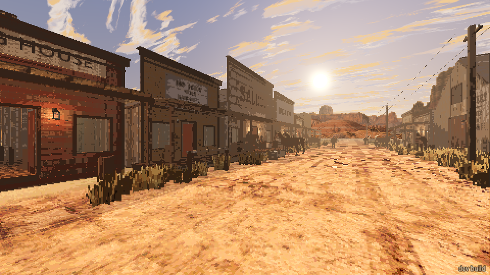

I walked into the store, where the storekeeper stood behind his counter. Then I walked into the saloon, a big warm room with lamps, a wall of bottles and the barkeep behind the bar.

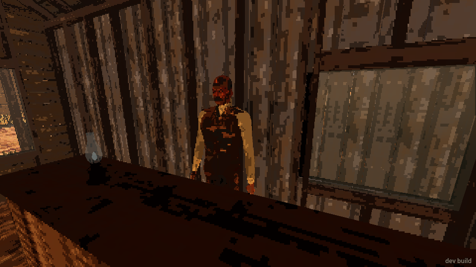
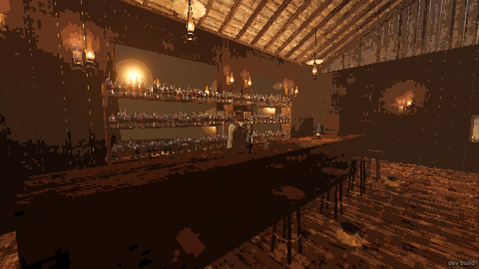

To provoke someone, I drew my revolver in front of the barkeep. He put his hands up at once and begged: "Take it! Take whatever you want!" He said it again every few seconds while the gun was out. I holstered, and he said "Lord. Lord, lord." and stayed "shaken" for minutes.

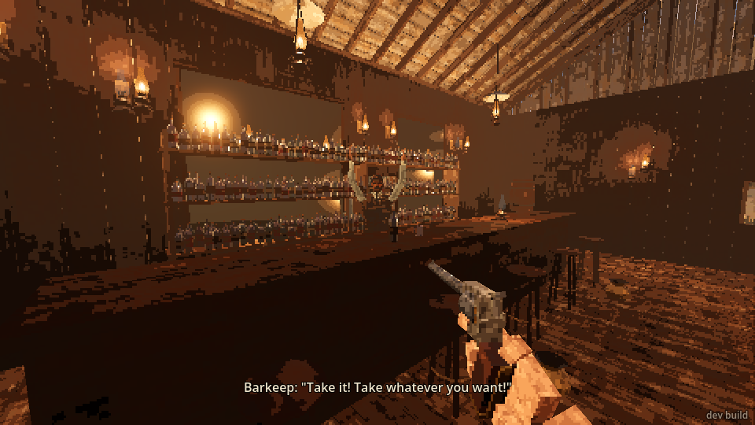

The gang (Brody, Lyle, the Kid) came in by themselves at about 50 seconds. They walked in rather than riding. They went to the bar and ordered ("Whiskey. Leave the bottle."). I was standing in their way, so Lyle stopped in my face: "Something I can do for you?", "Walk on, mister." When I moved, he said "That's better." This was the best moment of the session.

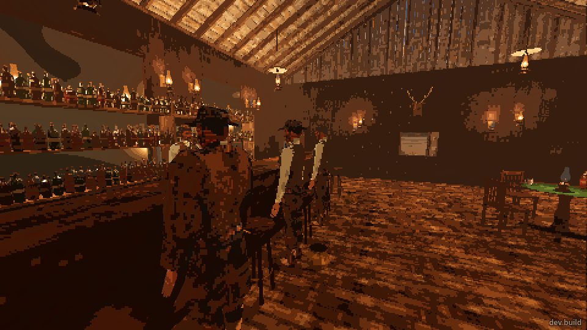
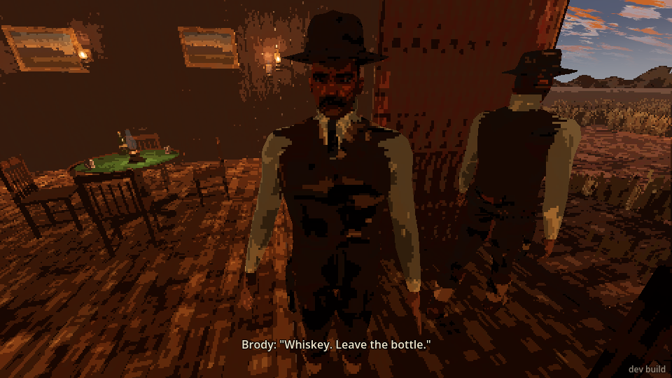

I followed Lyle and the Kid to the store. The Kid taunted the storekeeper ("Hurry it up, old man", "What's the matter, Pop? Hands shaking?"). Lyle drew on him: "Open the drawer. Slow." "Nice store. Shame if something happened to it."

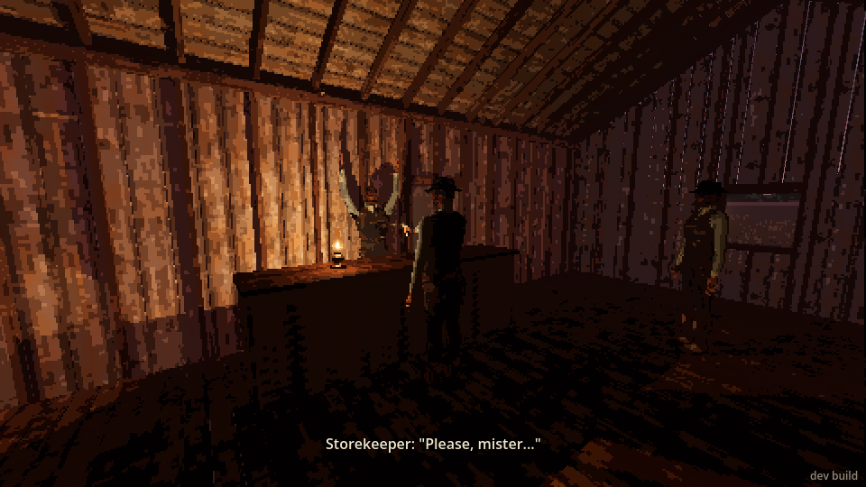

I stepped in. I drew, aimed at Lyle and shouted. Within three seconds the Kid had shot me in the arm and chest and Lyle had shot me in the belly. I was out cold before I fired once. The screen went dark. About 30 seconds later I woke in the back of the store with no wounds at all, facing a wall. Lyle and the Kid had left.

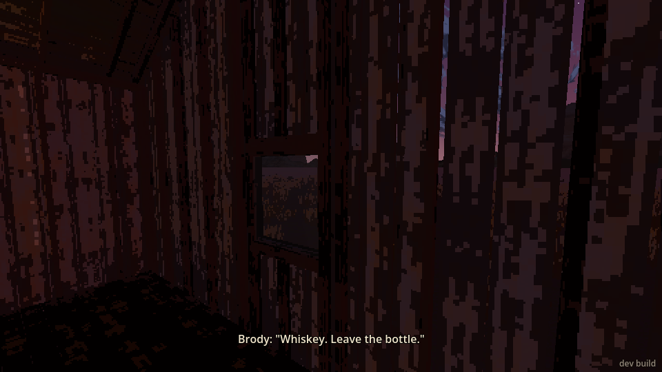
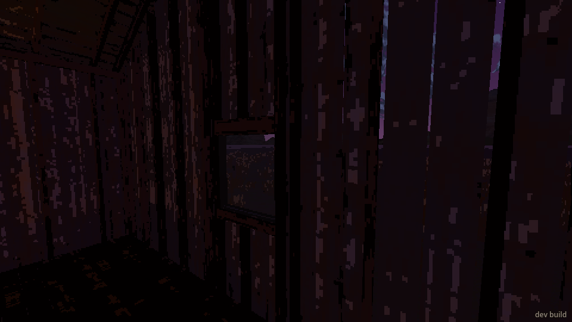

I ran after Brody and called him out with my gun holstered. He said "Suits me. Go on. Make your play." and then drew and shot me in the head, belly and thigh before I had my gun up. I came round in the store again, unhurt.

I set the clock back to 17:30 and brought the gang in again. I waited for them inside the store, crouched by the front window, with the shotgun. My shotgun put the Kid down and he surrendered ("Enough! It's yours!"). Brody yelled "Get up, you yellow dog!" Brody and Lyle ran to the saloon door and stood there together, half inside the wall, "searching" and shouting "Come on out!" I walked up to 8 metres in the open street and shot them both. Lyle: "Don't shoot! I quit, I quit!" Brody: "Son of a—!", "I'm hit, damn it!", "Alright! Alright! I'm done!"

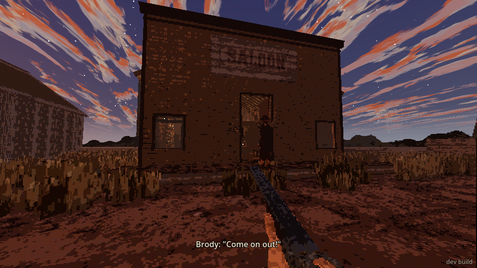
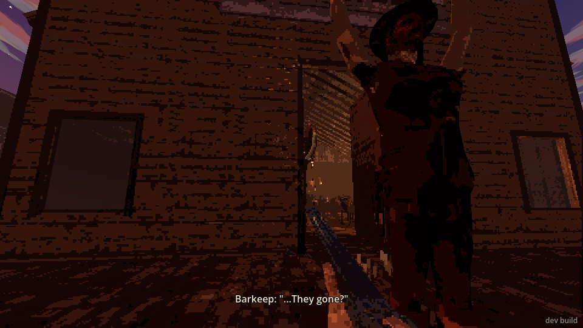

The armed man at the shooting range at the east end ("outlaw") joined in when I fired. He shot at me from about 20 metres, and one of his rounds hit two townsmen on their bench. Later I aimed at him and shouted "Drop it!" while holding the sights up. He gave up: "Don't shoot! I quit, I quit!"

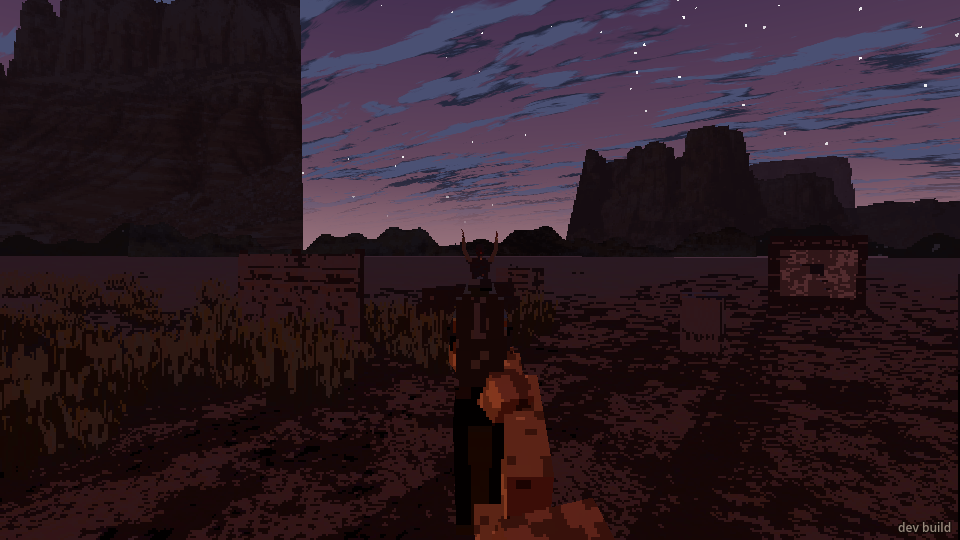

I threw dynamite at the barber's shop. The first stick went through the open door and only scorched the floor inside. The second, set down on the porch, broke one plank. Neither made a hole in the front.

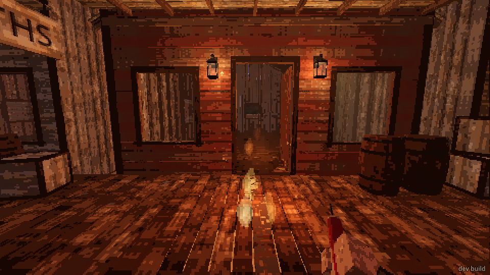
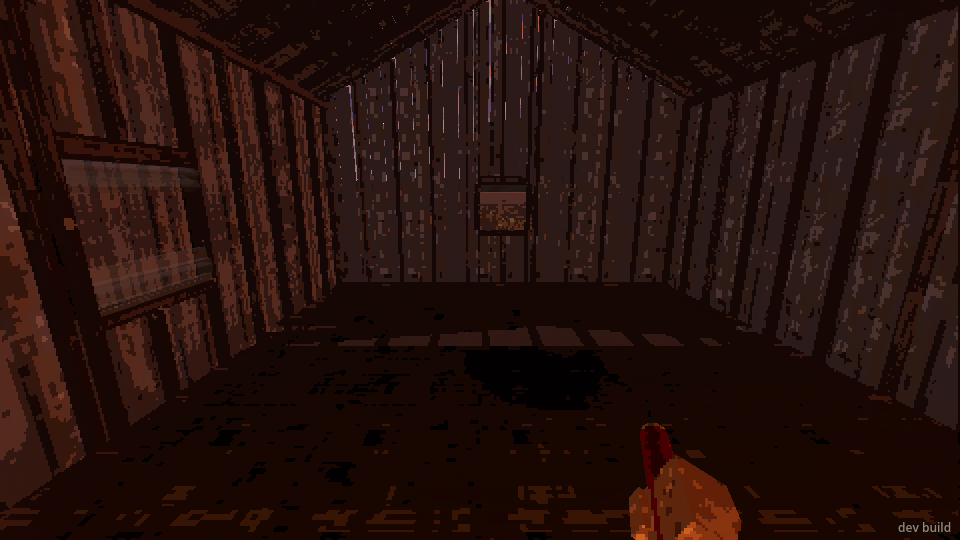

I set fire to the barber's with `ignite`. Ten seconds later one board was burning. At 35 seconds, 75 were burning. At 60 seconds, 560 were burning and the general store next door had caught. At 90 seconds the whole south side of the street was alight, with 1,800 boards burning. In about three minutes it had burnt flat. The townsfolk on the porches never moved. Five of them burnt to death: the store man, both bench men, the porch loafer, and the storekeeper behind his own counter.

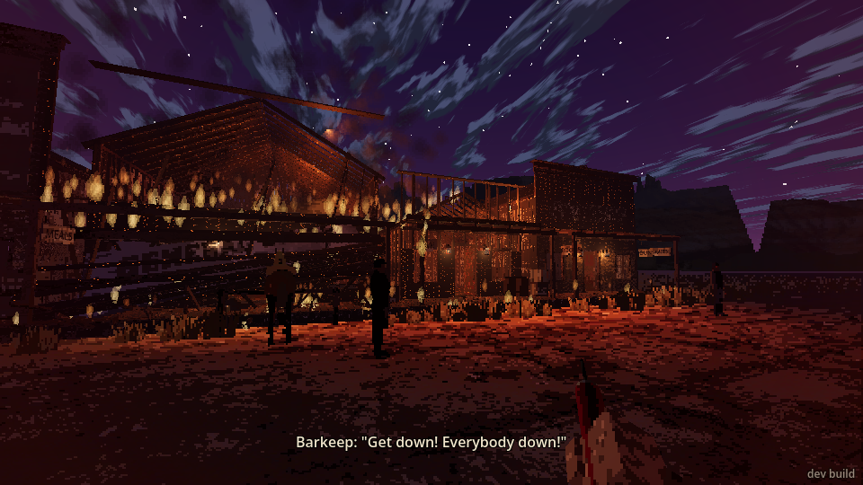
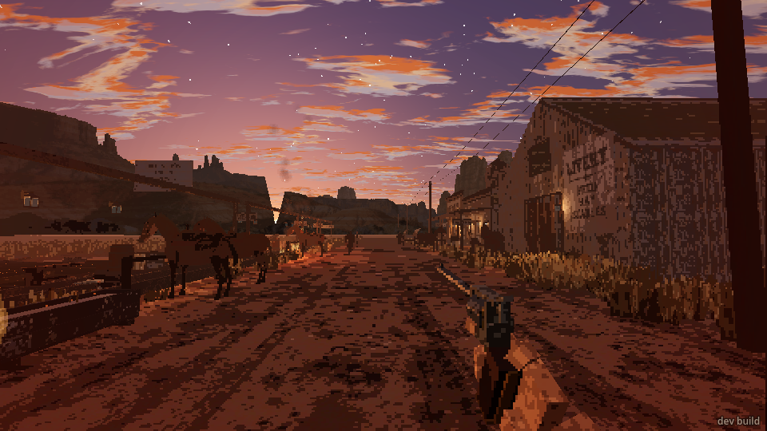

The gang were still standing with their hands up at the saloon door, still armed, five minutes later. I shot the surrendered Kid in the chest. He didn't react, and nobody said a word.

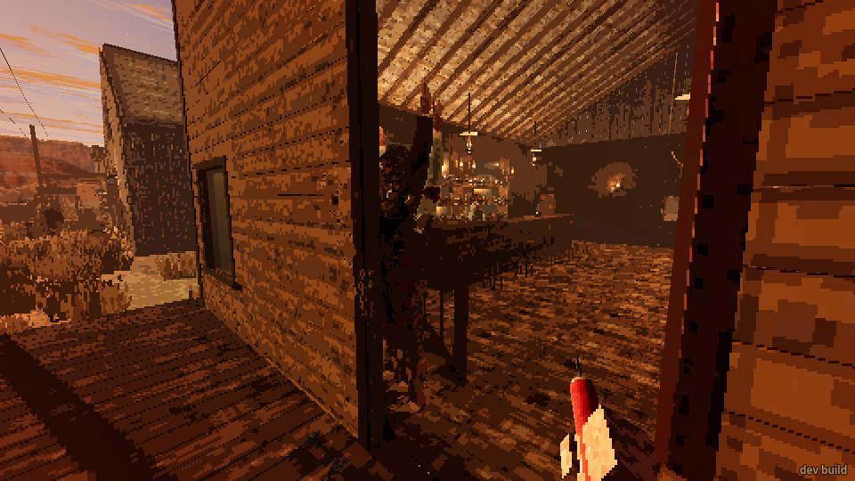
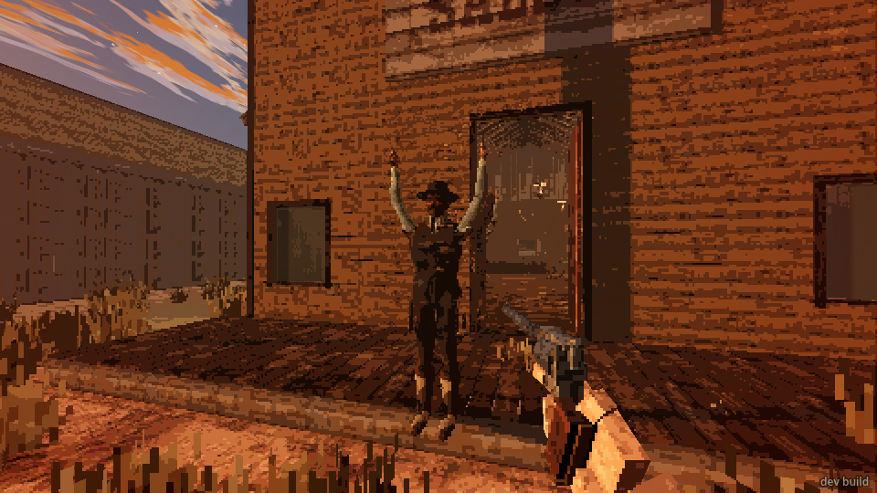

For the second run I restarted the game. I brought the gang in, drew on them at the bar and shouted. Lyle went up the ladder ("Walk on, mister." then "One more move..."). I crouched behind a card table and shot Lyle. The same ball hit the barkeep behind him. Brody shouted "Over there!", then called "drag" and went to pull Lyle into cover while the Kid called "Covering!" That was great. They shot me twice in the chest and I blacked out (a lovely smoky fade). Again I woke unhurt in the store a few seconds later. Lyle bled to death.

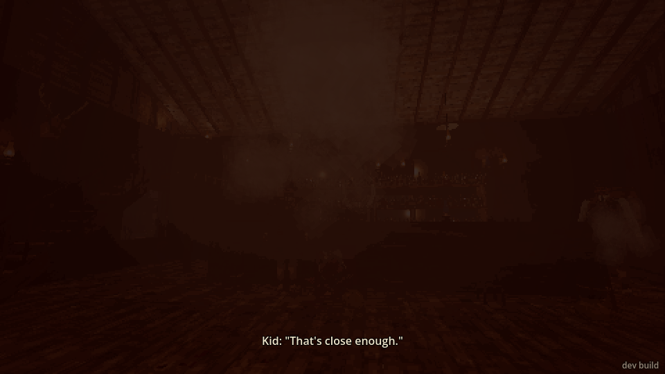

Brody came after me into the street and called "Reloading! Cover me!" I dropped him from the store with one chest hit at 20 metres. The Kid shouted "Go! I got him!" and "Don't shoot! I quit!" in the same instant. I then dropped the range man with one belly hit at 22 metres.

I still couldn't stay conscious long enough to tend a wound. So I used the testing command `spawn` to bring in one more outlaw (`spawn outlaw`). Then I used `fight` to make him fight. Firing at him from beside the store window went wrong in a good way: the glass broke and cut me in four places. That finally let me try `tend_wounds`.

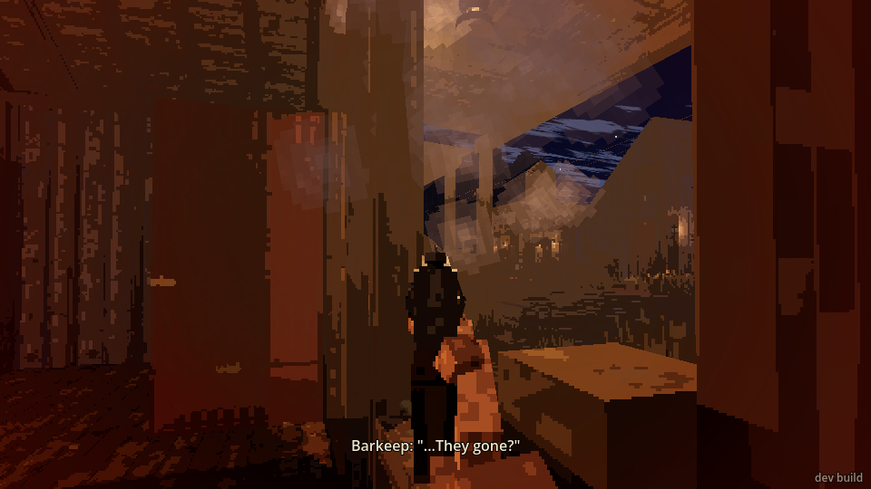

## What broke

- **People stuck inside walls.** After the Kid surrendered in run 1, Brody and Lyle ran to the saloon door and stood at the exact same spot (6.09, -17.18), one inside the other. They stayed there for the rest of the session. They were partly inside the wall beside the door. From outside you see one figure in the doorway (shot 19), and later only one of them shows at all (shots 31, 32). While stuck they shouted "Where'd he go?" and "Come on out!" but never fired back, even with me standing 8 m in front of them.
- **The surrendered Kid floats.** His feet hang below the edge of the saloon porch, in the air (shot 32).
- **Lanterns float in the air after their building burns away** (shot 33, left side).
- **`release` doesn't exist.** `help` lists `hold ACTION | release ACTION`, but `release aim` answers "no such command: release". After `hold aim`, the sights stayed up for the rest of that run. Later `hold tend_wounds` showed "holding: aim, tend_wounds".
- **`shoot` reports `fired: 0` when the gun did fire.** The events show "you fired" a moment later. Separately, right after a reload the revolver twice did nothing on `shoot 1`: the hammer cocked and fell, with no shot and no click in the events. The third try fired. Maybe these were empty chambers, but nothing tells you so.
- **`gang` and `fight` do nothing to men who have surrendered.** Both say ok, but the gang stayed at the door with their hands up.
- **The thrown dynamite went the wrong way.** I faced east, threw (`press fire 0.05`) and then turned around, all in one bridge call. The stick landed 11 m west, so the throw happened after the turn.
- **Walking reports "arrived" while you're blacking out.** In run 2 I was hit a third time while running to the store. `walk` said I'd arrived, but I'd been knocked out and moved to the store in the meantime.
- **The storekeeper's face** is a dark red-brown smear in the store's light (shot 3).
- **Light shows through the wall corners** of the store and the barber's as thin bright slits (shots 14, 26).
- **Stars show in the sky at golden hour** (around 17:40), as white dots among the orange clouds.
- **"My leg... damn you..."** is what Brody said when he was hit in the chest.

## What was flat or confusing

- **Gunfights are over before they start.** In every fight the gang hit me first, two or three times in two seconds, often in the chest or head. Three of my four fights ended with me out cold, the first two before I'd fired once. In the duel, Brody drew 4 seconds after accepting. At one frame a second that left no time to draw. When I shot first, they dropped from one hit at 20 m. It felt like whoever fires first wins, with no back-and-forth.
- **Getting hurt barely matters.** Every blackout ended within seconds of game time with me awake in the back of the store and completely healed: gut-shot, broken bone, head wound and all. No event says you passed out or came round. You wake facing a dark wall with no idea what happened.
- **I could never really test tending wounds.** Every gunshot fight knocked me out too fast. When I finally had wounds (the glass cuts), `tend_wounds` put my gun away and that's all I could tell. "How" stayed "Hurt, but steady.", the blood stayed the same, and no message or event said what I'd done. The screen was a smear of big blocks with the camera in the counter.
- **Nobody runs from fire.** Five people sat or stood at their posts while the fire reached them and burnt to death. The barkeep, 23 m away, shouted "Get down! Everybody down!" at the fire. Nobody fetched water or warned anyone. The horses stood next to the flames.
- **The fire is too fast and looks small.** One match took the whole south side of the street in about 90 seconds. Even with 560 boards "burning", the barber's front barely showed a flame. Later, the burning frames were covered in rows of small, evenly spaced flame tongues that look like candles.
- **Dynamite is weak against buildings.** Two sticks at the barber's front did almost nothing visible. One went through the open door. The other, set down on the porch, broke one plank.
- **Shooting a man with his hands up gets no reaction.** The Kid took a chest shot while surrendered, and neither he, his friends nor the townsfolk said anything.
- **Surrendered men keep their guns** and stand with their hands up indefinitely, wounded but not bleeding out (Lyle had 5 wounds).
- **The man at the range talks to nobody.** He stood alone at the east end and kept saying "Help you?", "Keep that iron where it is", "Don't you do it", "Go on, then", "That's how it is? Fine!". He was 20–50 m from anyone, often while things happened at the other end of town. I couldn't tell who he was talking to.
- **Townsfolk lines don't fit the moment.** Everyone says the same three lines in the same second ("Lord almighty!", "Get down! Everybody down!", "...They gone?"). The barkeep asked "...They gone?" with the surrendered gang in his doorway. The bench men said "Don't shoot! I got a family!" 20 m away while I was holding a stick of dynamite.
- **My own "Drop it!" never shows in the events or on screen**, so I couldn't tell if it worked. It only worked while holding the sights up with `hold aim`. With `press aim 3` followed by `press shout`, the man just escalated.
- **A spawned outlaw ignored two shots into the dirt 3 m from him.** He only reacted once I used `fight`.
- **When aiming, the hand and gun cover the man you're aiming at** (shot 21). In the store, crouched by the window, the shotgun filled half the screen.
- **The barber's shop and the store are empty rooms**, with no chairs, shelves or goods.

## What was fun

- **The look.** The street at golden hour, the red rock, the clouds and the saloon at night are all gorgeous. Every screenshot looks like a painting.
- **The gang has personality.** They order whiskey, sneer, crowd you when you're in the way ("Walk on, mister." ... "That's better."), lean on the storekeeper with real menace and climb the warning ladder when you draw ("Something I can do for you?" then "One more move...").
- **They fight as a team.** You hear "Over there!", "Reloading! Cover me!", "Covering!", "Kid's giving up!", "Get up, you yellow dog!", and Brody goes to drag his downed friend into cover. When it works, it feels alive.
- **Surrender lines.** "Son of a—!", "I'm hit, damn it!", "Alright! Alright! I'm done!" read like a Western.
- **Bullets go through people and things.** My ball went through Lyle and hit the barkeep. The range man's ball went through two townsmen. My own revolver shot through the store window cut me with the glass.
- **The fire, as a spectacle.** The whole frame of the general store burnt and fell in, with the sky going violet behind it. It's dramatic.
- **The blackout.** The saloon fading into brown smoke as I went down was a striking moment.

## The top three things to fix

1. **The gunfight's pace and what getting hurt costs.** The gang hits too fast and too often, the player drops in 1–3 hits, and blacking out heals everything in seconds. That leaves no fight, no tending and no consequence. Give the player a moment to act and a reason to care about wounds.
2. **Men stuck in walls and not fighting back.** Brody and Lyle sat inside the saloon's door frame at one shared spot for the rest of the session, blind to me at 8 m. The Kid floated off the porch edge.
3. **People don't react to fire, or to shooting surrendered men.** Five townsfolk burnt to death at their posts while the town went up in 90 seconds. Shooting a man with his hands up got no reaction from anyone. Townsfolk should flee and shout about fire, and an execution should be a deed people notice.
