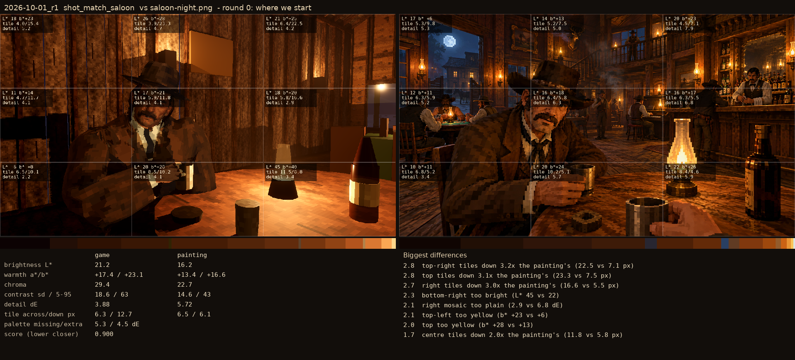
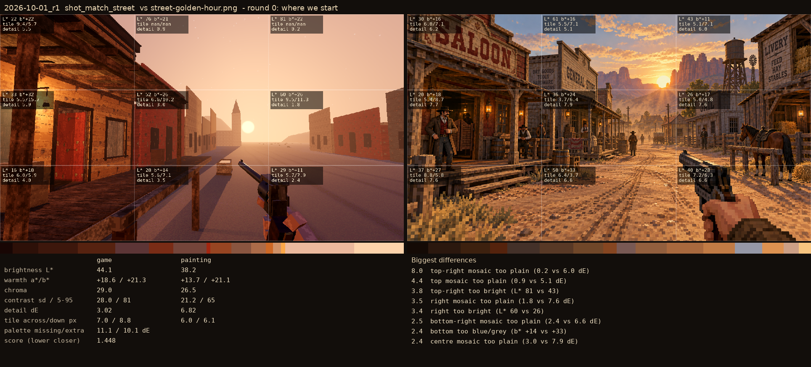

# 2026-10-01_r1: round 0: where we start

## shot_match_saloon (score 0.900, lower is closer)

- 2.8 top-right tiles down 3.2x the painting's (22.5 vs 7.1 px)
- 2.8 top tiles down 3.1x the painting's (23.3 vs 7.5 px)
- 2.7 right tiles down 3.0x the painting's (16.6 vs 5.5 px)
- 2.3 bottom-right too bright (L* 45 vs 22)
- 2.1 right mosaic too plain (2.9 vs 6.8 dE)
- 2.1 top-left too yellow (b* +23 vs +6)
- 2.0 top too yellow (b* +28 vs +13)
- 1.7 centre tiles down 2.0x the painting's (11.8 vs 5.8 px)

## shot_match_street (score 1.448, lower is closer)

- 8.0 top-right mosaic too plain (0.2 vs 6.0 dE)
- 4.4 top mosaic too plain (0.9 vs 5.1 dE)
- 3.8 top-right too bright (L* 81 vs 43)
- 3.5 right mosaic too plain (1.8 vs 7.6 dE)
- 3.4 right too bright (L* 60 vs 26)
- 2.5 bottom-right mosaic too plain (2.4 vs 6.6 dE)
- 2.4 bottom too blue/grey (b* +14 vs +33)
- 2.4 centre mosaic too plain (3.0 vs 7.9 dE)
