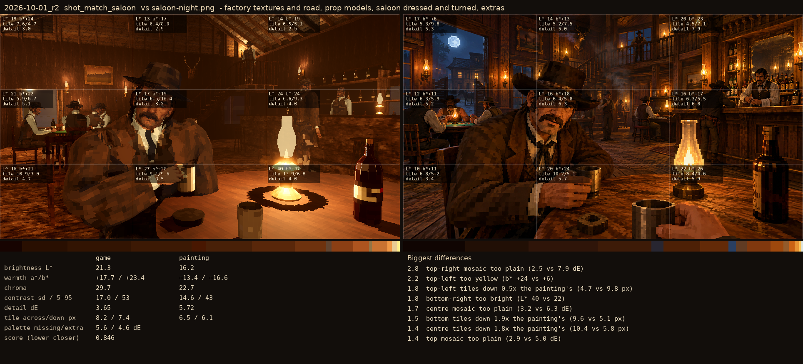
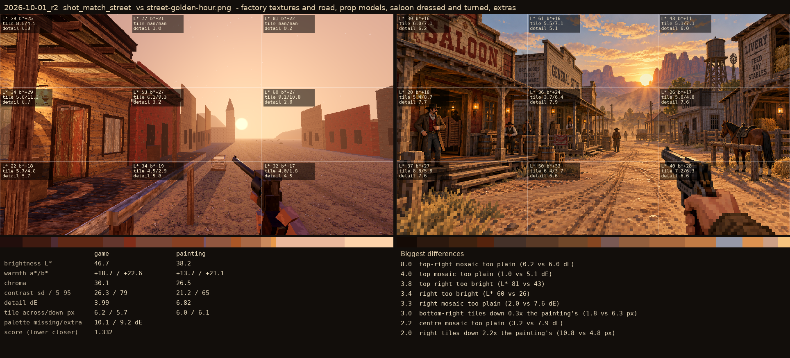

# 2026-10-01_r2: factory textures and road, prop models, saloon dressed and turned, extras

## shot_match_saloon (score 0.846, lower is closer)

- 2.8 top-right mosaic too plain (2.5 vs 7.9 dE)
- 2.2 top-left too yellow (b* +24 vs +6)
- 1.8 top-left tiles down 0.5x the painting's (4.7 vs 9.8 px)
- 1.8 bottom-right too bright (L* 40 vs 22)
- 1.7 centre mosaic too plain (3.2 vs 6.3 dE)
- 1.5 bottom tiles down 1.9x the painting's (9.6 vs 5.1 px)
- 1.4 centre tiles down 1.8x the painting's (10.4 vs 5.8 px)
- 1.4 top mosaic too plain (2.9 vs 5.0 dE)

## shot_match_street (score 1.332, lower is closer)

- 8.0 top-right mosaic too plain (0.2 vs 6.0 dE)
- 4.0 top mosaic too plain (1.0 vs 5.1 dE)
- 3.8 top-right too bright (L* 81 vs 43)
- 3.4 right too bright (L* 60 vs 26)
- 3.3 right mosaic too plain (2.0 vs 7.6 dE)
- 3.0 bottom-right tiles down 0.3x the painting's (1.8 vs 6.3 px)
- 2.2 centre mosaic too plain (3.2 vs 7.9 dE)
- 2.0 right tiles down 2.2x the painting's (10.8 vs 4.8 px)
