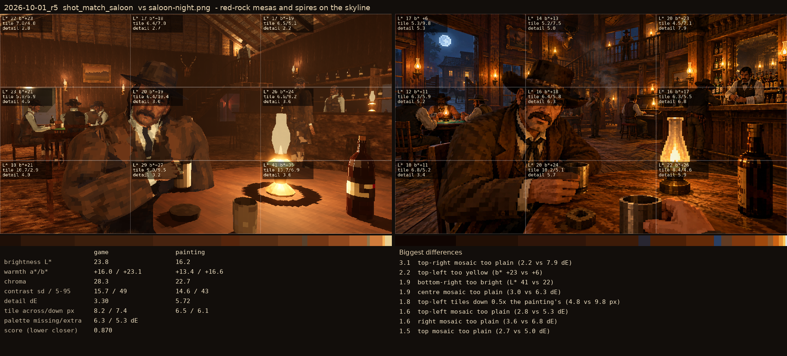
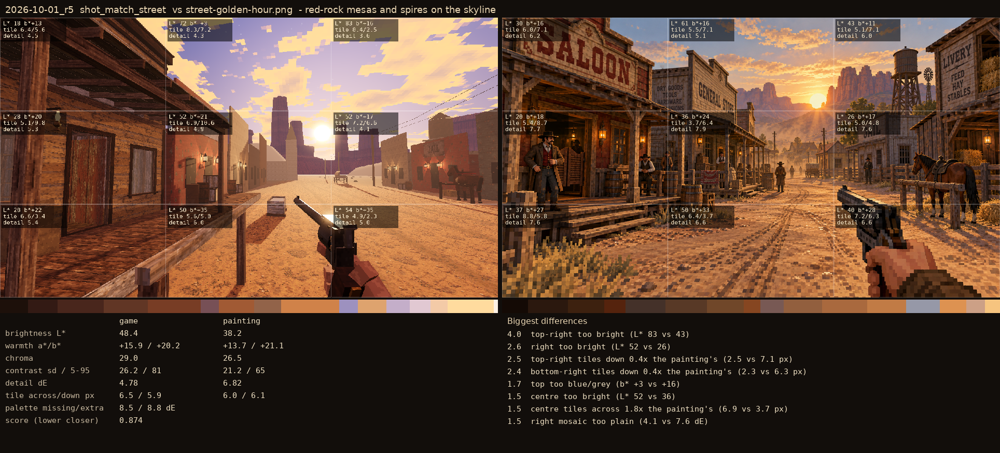

# 2026-10-01_r5: red-rock mesas and spires on the skyline

## shot_match_saloon (score 0.870, lower is closer)

- 3.1 top-right mosaic too plain (2.2 vs 7.9 dE)
- 2.2 top-left too yellow (b* +23 vs +6)
- 1.9 bottom-right too bright (L* 41 vs 22)
- 1.9 centre mosaic too plain (3.0 vs 6.3 dE)
- 1.8 top-left tiles down 0.5x the painting's (4.8 vs 9.8 px)
- 1.6 top-left mosaic too plain (2.8 vs 5.3 dE)
- 1.6 right mosaic too plain (3.6 vs 6.8 dE)
- 1.5 top mosaic too plain (2.7 vs 5.0 dE)

## shot_match_street (score 0.874, lower is closer)

- 4.0 top-right too bright (L* 83 vs 43)
- 2.6 right too bright (L* 52 vs 26)
- 2.5 top-right tiles down 0.4x the painting's (2.5 vs 7.1 px)
- 2.4 bottom-right tiles down 0.4x the painting's (2.3 vs 6.3 px)
- 1.7 top too blue/grey (b* +3 vs +16)
- 1.5 centre too bright (L* 52 vs 36)
- 1.5 centre tiles across 1.8x the painting's (6.9 vs 3.7 px)
- 1.5 right mosaic too plain (4.1 vs 7.6 dE)
