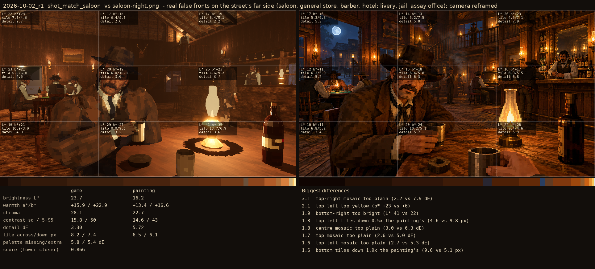
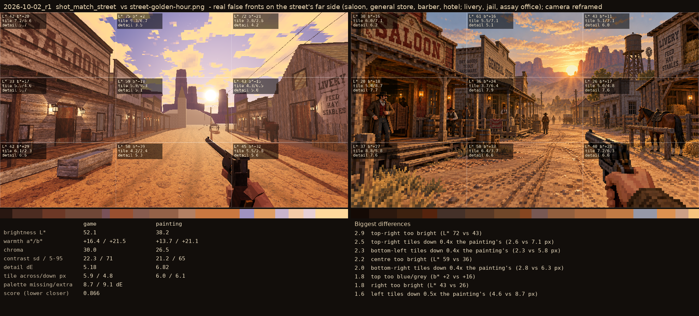

# 2026-10-02_r1: real false fronts on the street's far side (saloon, general store, barber, hotel; livery, jail, assay office); camera reframed

## shot_match_saloon (score 0.866, lower is closer)

- 3.1 top-right mosaic too plain (2.2 vs 7.9 dE)
- 2.1 top-left too yellow (b* +23 vs +6)
- 1.9 bottom-right too bright (L* 41 vs 22)
- 1.8 top-left tiles down 0.5x the painting's (4.6 vs 9.8 px)
- 1.8 centre mosaic too plain (3.0 vs 6.3 dE)
- 1.7 top mosaic too plain (2.6 vs 5.0 dE)
- 1.6 top-left mosaic too plain (2.7 vs 5.3 dE)
- 1.6 bottom tiles down 1.9x the painting's (9.6 vs 5.1 px)

## shot_match_street (score 0.866, lower is closer)

- 2.9 top-right too bright (L* 72 vs 43)
- 2.5 top-right tiles down 0.4x the painting's (2.6 vs 7.1 px)
- 2.3 bottom-left tiles down 0.4x the painting's (2.3 vs 5.8 px)
- 2.2 centre too bright (L* 59 vs 36)
- 2.0 bottom-right tiles down 0.4x the painting's (2.8 vs 6.3 px)
- 1.8 top too blue/grey (b* +2 vs +16)
- 1.8 right too bright (L* 43 vs 26)
- 1.6 left tiles down 0.5x the painting's (4.6 vs 8.7 px)
