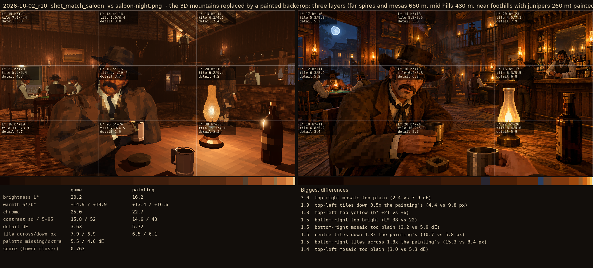
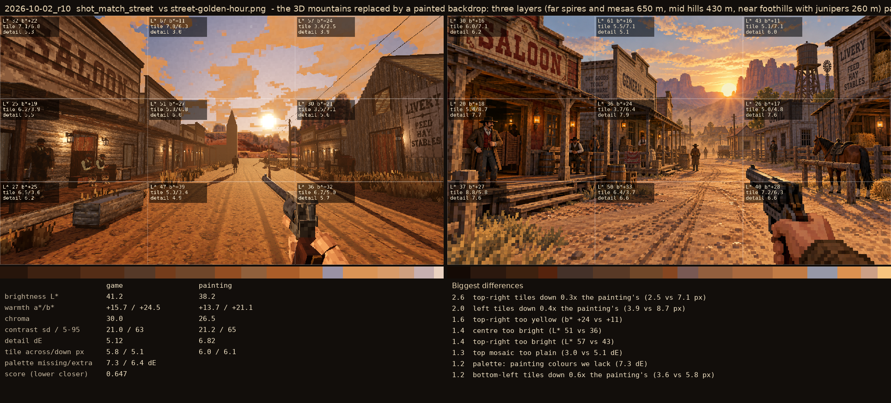

# 2026-10-02_r10: the 3D mountains replaced by a painted backdrop: three layers (far spires and mesas 650 m, mid hills 430 m, near foothills with junipers 260 m) painted on a green screen by FLUX.2 [max], cut to squares at 0.3 degrees a texel, lit by the time of day (gold rims, warm shade, dark at night); the cathedral spires right of the sun down the street

## shot_match_saloon (score 0.763, lower is closer)

- 3.0 top-right mosaic too plain (2.4 vs 7.9 dE)
- 1.9 top-left tiles down 0.5x the painting's (4.4 vs 9.8 px)
- 1.8 top-left too yellow (b* +21 vs +6)
- 1.5 bottom-right too bright (L* 38 vs 22)
- 1.5 bottom-right mosaic too plain (3.2 vs 5.9 dE)
- 1.5 centre tiles down 1.8x the painting's (10.7 vs 5.8 px)
- 1.5 bottom-right tiles across 1.8x the painting's (15.3 vs 8.4 px)
- 1.4 top-left mosaic too plain (3.0 vs 5.3 dE)

## shot_match_street (score 0.647, lower is closer)

- 2.6 top-right tiles down 0.3x the painting's (2.5 vs 7.1 px)
- 2.0 left tiles down 0.4x the painting's (3.9 vs 8.7 px)
- 1.6 top-right too yellow (b* +24 vs +11)
- 1.4 centre too bright (L* 51 vs 36)
- 1.4 top-right too bright (L* 57 vs 43)
- 1.3 top mosaic too plain (3.0 vs 5.1 dE)
- 1.2 palette: painting colours we lack (7.3 dE)
- 1.2 bottom-left tiles down 0.6x the painting's (3.6 vs 5.8 px)
