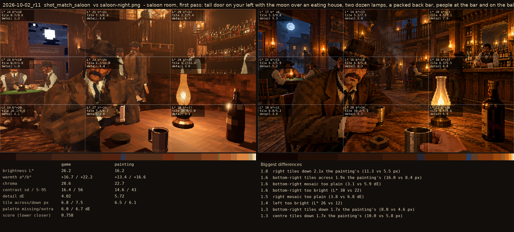
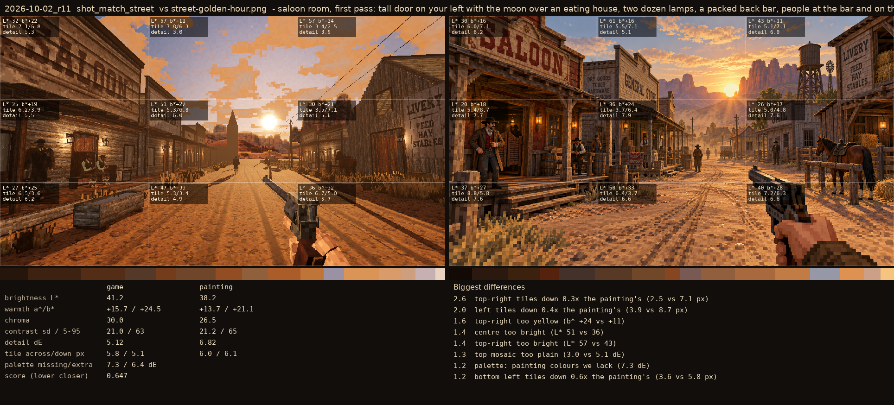

# 2026-10-02_r11: saloon room, first pass: tall door on your left with the moon over an eating house, two dozen lamps, a packed back bar, people at the bar and on the balcony (street from r10)

## shot_match_saloon (score 0.758, lower is closer)

- 1.8 right tiles down 2.1x the painting's (11.3 vs 5.5 px)
- 1.6 bottom-right tiles across 1.9x the painting's (16.0 vs 8.4 px)
- 1.6 bottom-right mosaic too plain (3.1 vs 5.9 dE)
- 1.6 bottom-right too bright (L* 38 vs 22)
- 1.5 right mosaic too plain (3.8 vs 6.8 dE)
- 1.4 left too bright (L* 26 vs 12)
- 1.3 bottom-right tiles down 1.7x the painting's (8.0 vs 4.6 px)
- 1.3 centre tiles down 1.7x the painting's (10.0 vs 5.8 px)

## shot_match_street (score 0.647, lower is closer)

- 2.6 top-right tiles down 0.3x the painting's (2.5 vs 7.1 px)
- 2.0 left tiles down 0.4x the painting's (3.9 vs 8.7 px)
- 1.6 top-right too yellow (b* +24 vs +11)
- 1.4 centre too bright (L* 51 vs 36)
- 1.4 top-right too bright (L* 57 vs 43)
- 1.3 top mosaic too plain (3.0 vs 5.1 dE)
- 1.2 palette: painting colours we lack (7.3 dE)
- 1.2 bottom-left tiles down 0.6x the painting's (3.6 vs 5.8 px)
