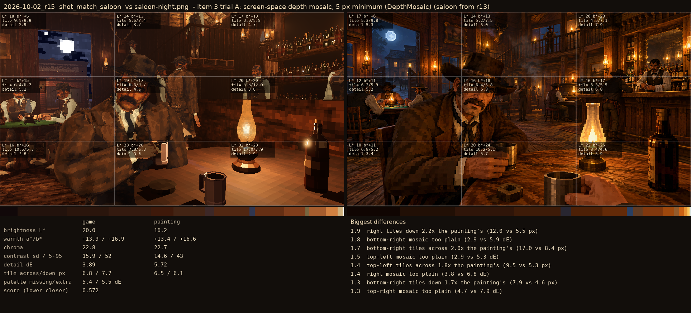
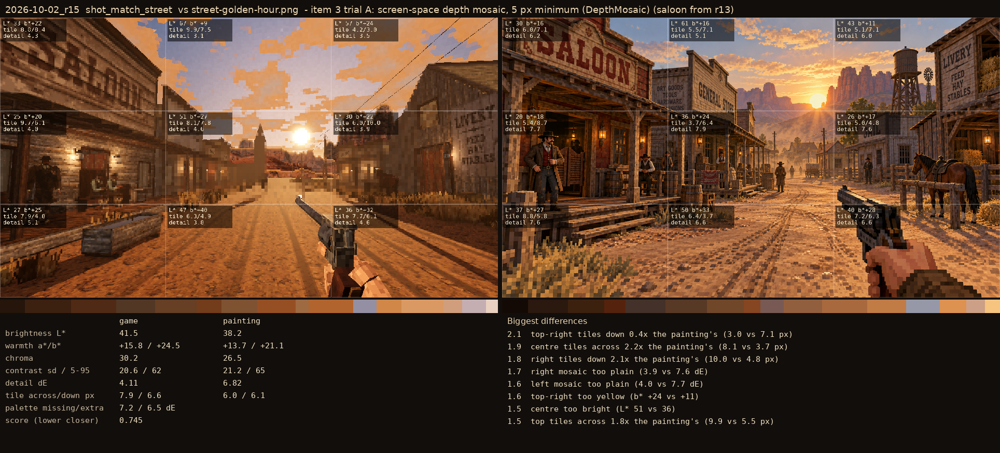

# 2026-10-02_r15: item 3 trial A: screen-space depth mosaic, 5 px minimum (DepthMosaic) (saloon from r13)

## shot_match_saloon (score 0.572, lower is closer)

- 1.9 right tiles down 2.2x the painting's (12.0 vs 5.5 px)
- 1.8 bottom-right mosaic too plain (2.9 vs 5.9 dE)
- 1.7 bottom-right tiles across 2.0x the painting's (17.0 vs 8.4 px)
- 1.5 top-left mosaic too plain (2.9 vs 5.3 dE)
- 1.4 top-left tiles across 1.8x the painting's (9.5 vs 5.3 px)
- 1.4 right mosaic too plain (3.8 vs 6.8 dE)
- 1.3 bottom-right tiles down 1.7x the painting's (7.9 vs 4.6 px)
- 1.3 top-right mosaic too plain (4.7 vs 7.9 dE)

## shot_match_street (score 0.745, lower is closer)

- 2.1 top-right tiles down 0.4x the painting's (3.0 vs 7.1 px)
- 1.9 centre tiles across 2.2x the painting's (8.1 vs 3.7 px)
- 1.8 right tiles down 2.1x the painting's (10.0 vs 4.8 px)
- 1.7 right mosaic too plain (3.9 vs 7.6 dE)
- 1.6 left mosaic too plain (4.0 vs 7.7 dE)
- 1.6 top-right too yellow (b* +24 vs +11)
- 1.5 centre too bright (L* 51 vs 36)
- 1.5 top tiles across 1.8x the painting's (9.9 vs 5.5 px)
