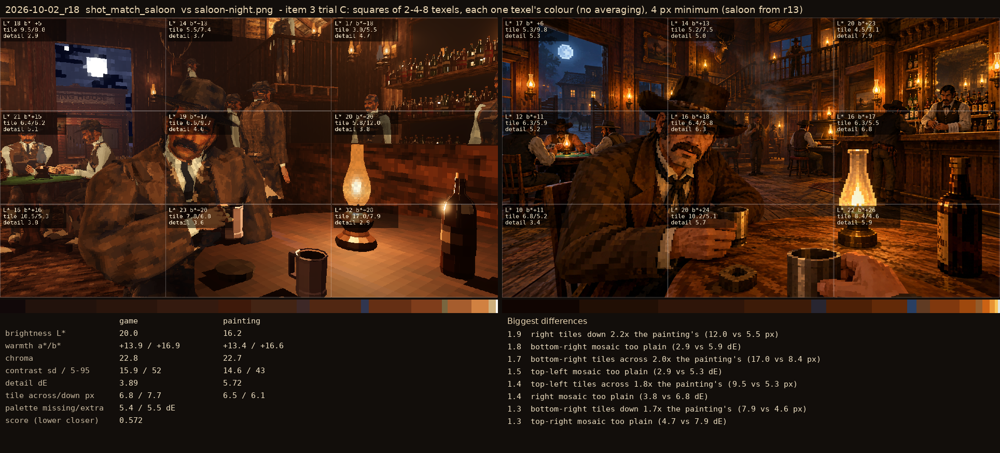
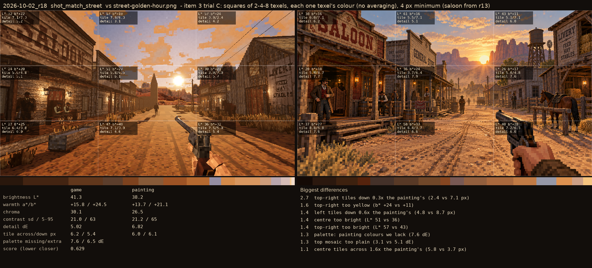

# 2026-10-02_r18: item 3 trial C: squares of 2-4-8 texels, each one texel's colour (no averaging), 4 px minimum (saloon from r13)

## shot_match_saloon (score 0.572, lower is closer)

- 1.9 right tiles down 2.2x the painting's (12.0 vs 5.5 px)
- 1.8 bottom-right mosaic too plain (2.9 vs 5.9 dE)
- 1.7 bottom-right tiles across 2.0x the painting's (17.0 vs 8.4 px)
- 1.5 top-left mosaic too plain (2.9 vs 5.3 dE)
- 1.4 top-left tiles across 1.8x the painting's (9.5 vs 5.3 px)
- 1.4 right mosaic too plain (3.8 vs 6.8 dE)
- 1.3 bottom-right tiles down 1.7x the painting's (7.9 vs 4.6 px)
- 1.3 top-right mosaic too plain (4.7 vs 7.9 dE)

## shot_match_street (score 0.629, lower is closer)

- 2.7 top-right tiles down 0.3x the painting's (2.4 vs 7.1 px)
- 1.6 top-right too yellow (b* +24 vs +11)
- 1.4 left tiles down 0.6x the painting's (4.8 vs 8.7 px)
- 1.4 centre too bright (L* 51 vs 36)
- 1.4 top-right too bright (L* 57 vs 43)
- 1.3 palette: painting colours we lack (7.6 dE)
- 1.3 top mosaic too plain (3.1 vs 5.1 dE)
- 1.1 centre tiles across 1.6x the painting's (5.8 vs 3.7 px)
