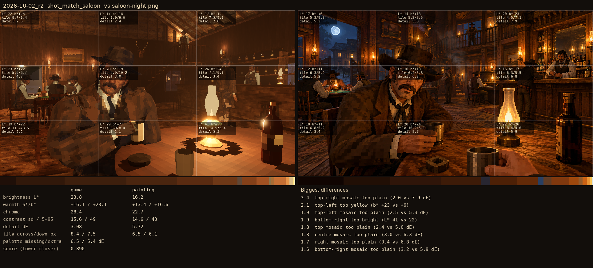
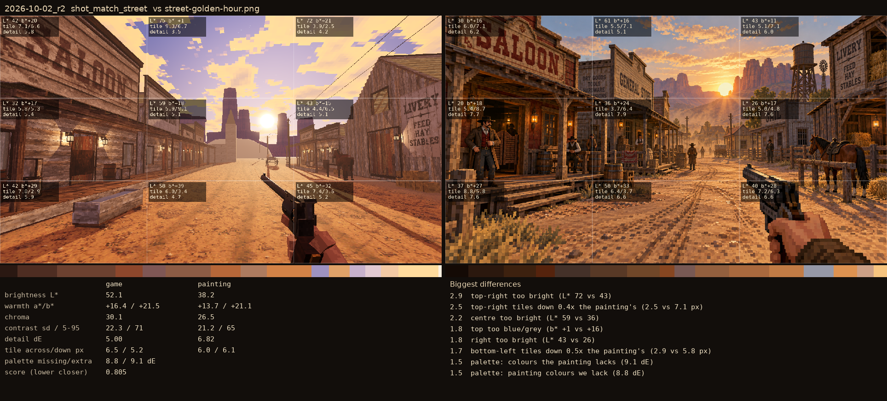

# 2026-10-02_r2

_world texels 64 → 32 a metre; factory textures re-cut at 32_

## shot_match_saloon (score 0.890, lower is closer)

- 3.4 top-right mosaic too plain (2.0 vs 7.9 dE)
- 2.1 top-left too yellow (b* +23 vs +6)
- 1.9 top-left mosaic too plain (2.5 vs 5.3 dE)
- 1.9 bottom-right too bright (L* 41 vs 22)
- 1.8 top mosaic too plain (2.4 vs 5.0 dE)
- 1.8 centre mosaic too plain (3.0 vs 6.3 dE)
- 1.7 right mosaic too plain (3.4 vs 6.8 dE)
- 1.6 bottom-right mosaic too plain (3.2 vs 5.9 dE)

## shot_match_street (score 0.805, lower is closer)

- 2.9 top-right too bright (L* 72 vs 43)
- 2.5 top-right tiles down 0.4x the painting's (2.5 vs 7.1 px)
- 2.2 centre too bright (L* 59 vs 36)
- 1.8 top too blue/grey (b* +1 vs +16)
- 1.8 right too bright (L* 43 vs 26)
- 1.7 bottom-left tiles down 0.5x the painting's (2.9 vs 5.8 px)
- 1.5 palette: colours the painting lacks (9.1 dE)
- 1.5 palette: painting colours we lack (8.8 dE)
