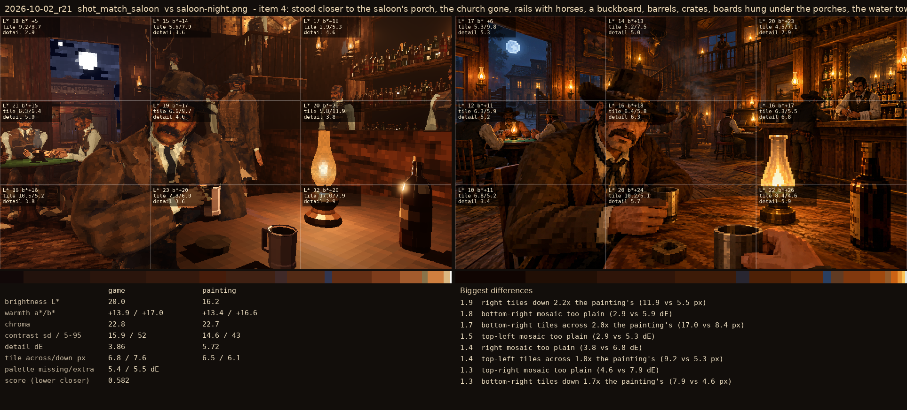
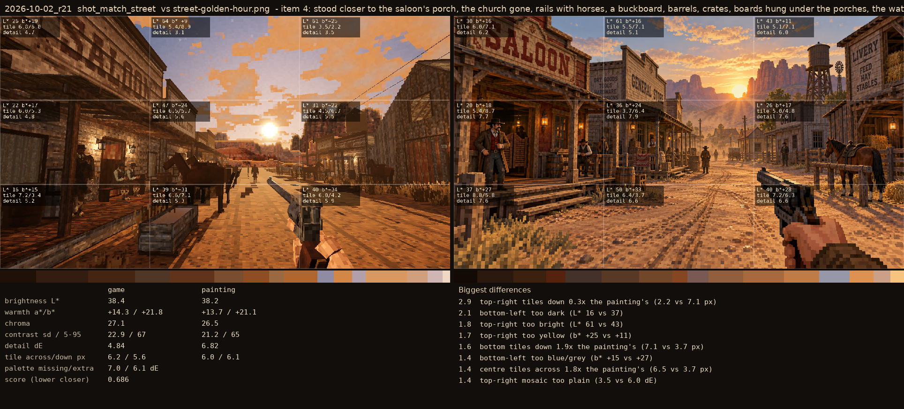

# 2026-10-02_r21: item 4: stood closer to the saloon's porch, the church gone, rails with horses, a buckboard, barrels, crates, boards hung under the porches, the water tower over the roofs on the right (saloon from r20)

## shot_match_saloon (score 0.582, lower is closer)

- 1.9 right tiles down 2.2x the painting's (11.9 vs 5.5 px)
- 1.8 bottom-right mosaic too plain (2.9 vs 5.9 dE)
- 1.7 bottom-right tiles across 2.0x the painting's (17.0 vs 8.4 px)
- 1.5 top-left mosaic too plain (2.9 vs 5.3 dE)
- 1.4 right mosaic too plain (3.8 vs 6.8 dE)
- 1.4 top-left tiles across 1.8x the painting's (9.2 vs 5.3 px)
- 1.3 top-right mosaic too plain (4.6 vs 7.9 dE)
- 1.3 bottom-right tiles down 1.7x the painting's (7.9 vs 4.6 px)

## shot_match_street (score 0.686, lower is closer)

- 2.9 top-right tiles down 0.3x the painting's (2.2 vs 7.1 px)
- 2.1 bottom-left too dark (L* 16 vs 37)
- 1.8 top-right too bright (L* 61 vs 43)
- 1.7 top-right too yellow (b* +25 vs +11)
- 1.6 bottom tiles down 1.9x the painting's (7.1 vs 3.7 px)
- 1.4 bottom-left too blue/grey (b* +15 vs +27)
- 1.4 centre tiles across 1.8x the painting's (6.5 vs 3.7 px)
- 1.4 top-right mosaic too plain (3.5 vs 6.0 dE)
