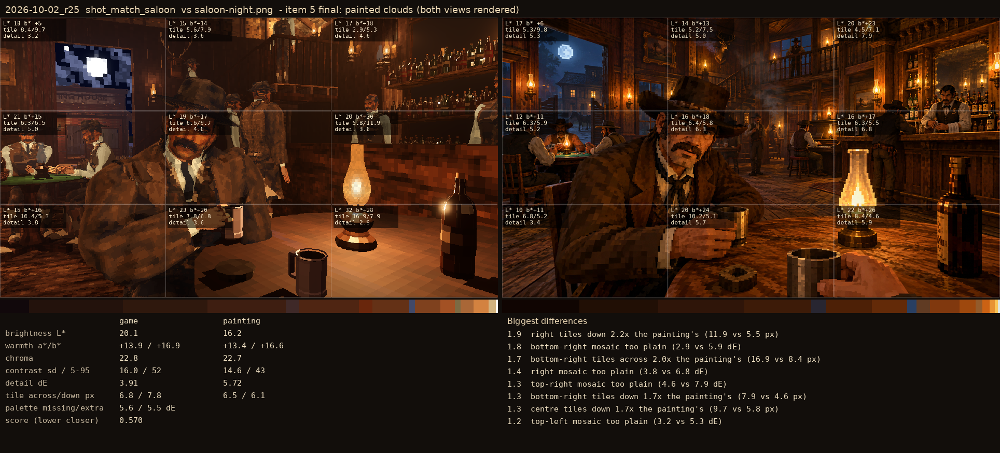
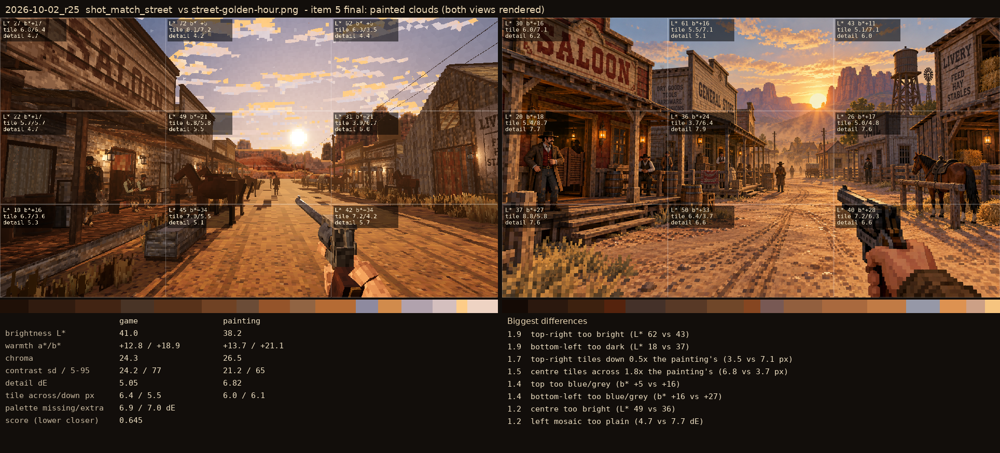

# 2026-10-02_r25: item 5 final: painted clouds (both views rendered)

## shot_match_saloon (score 0.570, lower is closer)

- 1.9 right tiles down 2.2x the painting's (11.9 vs 5.5 px)
- 1.8 bottom-right mosaic too plain (2.9 vs 5.9 dE)
- 1.7 bottom-right tiles across 2.0x the painting's (16.9 vs 8.4 px)
- 1.4 right mosaic too plain (3.8 vs 6.8 dE)
- 1.3 top-right mosaic too plain (4.6 vs 7.9 dE)
- 1.3 bottom-right tiles down 1.7x the painting's (7.9 vs 4.6 px)
- 1.3 centre tiles down 1.7x the painting's (9.7 vs 5.8 px)
- 1.2 top-left mosaic too plain (3.2 vs 5.3 dE)

## shot_match_street (score 0.645, lower is closer)

- 1.9 top-right too bright (L* 62 vs 43)
- 1.9 bottom-left too dark (L* 18 vs 37)
- 1.7 top-right tiles down 0.5x the painting's (3.5 vs 7.1 px)
- 1.5 centre tiles across 1.8x the painting's (6.8 vs 3.7 px)
- 1.4 top too blue/grey (b* +5 vs +16)
- 1.4 bottom-left too blue/grey (b* +16 vs +27)
- 1.2 centre too bright (L* 49 vs 36)
- 1.2 left mosaic too plain (4.7 vs 7.7 dE)
