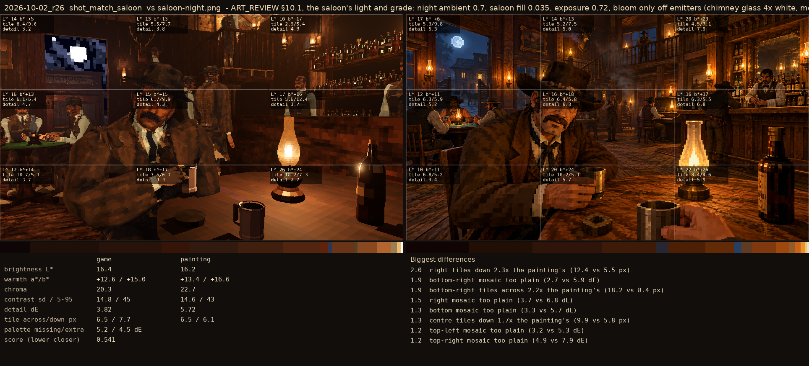
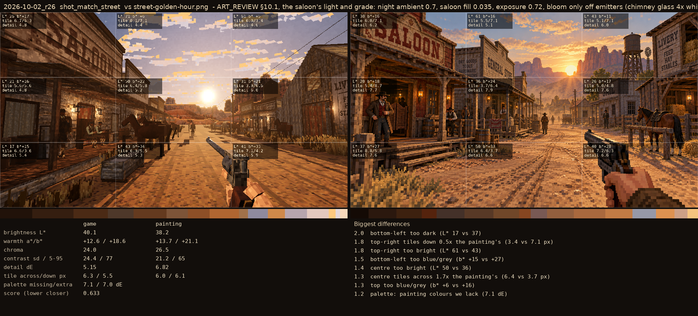

# 2026-10-02_r26: ART_REVIEW §10.1, the saloon's light and grade: night ambient 0.7, saloon fill 0.035, exposure 0.72, bloom only off emitters (chimney glass 4x white, moon 2.5; glow screen, threshold 1.7, bloom 0), saturation 1.12, bar lamps x1.5. Median L* 12, deep shadow 40% (the painting's 12, 41%)

## shot_match_saloon (score 0.541, lower is closer)

- 2.0 right tiles down 2.3x the painting's (12.4 vs 5.5 px)
- 1.9 bottom-right mosaic too plain (2.7 vs 5.9 dE)
- 1.9 bottom-right tiles across 2.2x the painting's (18.2 vs 8.4 px)
- 1.5 right mosaic too plain (3.7 vs 6.8 dE)
- 1.3 bottom mosaic too plain (3.3 vs 5.7 dE)
- 1.3 centre tiles down 1.7x the painting's (9.9 vs 5.8 px)
- 1.2 top-left mosaic too plain (3.2 vs 5.3 dE)
- 1.2 top-right mosaic too plain (4.9 vs 7.9 dE)

## shot_match_street (score 0.633, lower is closer)

- 2.0 bottom-left too dark (L* 17 vs 37)
- 1.8 top-right tiles down 0.5x the painting's (3.4 vs 7.1 px)
- 1.8 top-right too bright (L* 61 vs 43)
- 1.5 bottom-left too blue/grey (b* +15 vs +27)
- 1.4 centre too bright (L* 50 vs 36)
- 1.3 centre tiles across 1.7x the painting's (6.4 vs 3.7 px)
- 1.3 top too blue/grey (b* +6 vs +16)
- 1.2 palette: painting colours we lack (7.1 dE)
