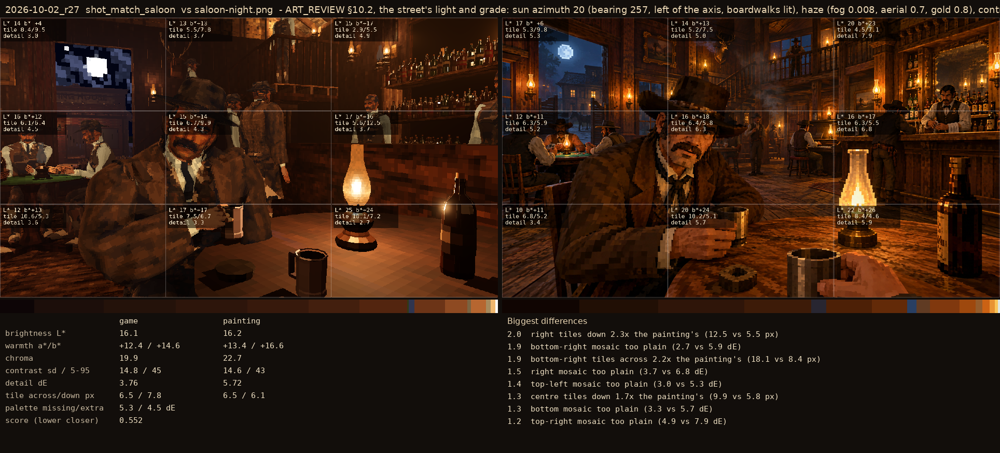
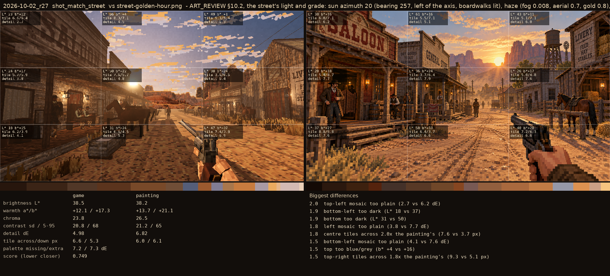

# 2026-10-02_r27: ART_REVIEW §10.2, the street's light and grade: sun azimuth 20 (bearing 257, left of the axis, boardwalks lit), haze (fog 0.008, aerial 0.7, gold 0.8), contrast 1.15, ambient_low_sun 0.6, horizon band and clouds dimmed at low sun, road lightness 1.3. Sky median L* 41 (painting 40), blown 2.1% (1.6%)

## shot_match_saloon (score 0.552, lower is closer)

- 2.0 right tiles down 2.3x the painting's (12.5 vs 5.5 px)
- 1.9 bottom-right mosaic too plain (2.7 vs 5.9 dE)
- 1.9 bottom-right tiles across 2.2x the painting's (18.1 vs 8.4 px)
- 1.5 right mosaic too plain (3.7 vs 6.8 dE)
- 1.4 top-left mosaic too plain (3.0 vs 5.3 dE)
- 1.3 centre tiles down 1.7x the painting's (9.9 vs 5.8 px)
- 1.3 bottom mosaic too plain (3.3 vs 5.7 dE)
- 1.2 top-right mosaic too plain (4.9 vs 7.9 dE)

## shot_match_street (score 0.749, lower is closer)

- 2.0 top-left mosaic too plain (2.7 vs 6.2 dE)
- 1.9 bottom-left too dark (L* 18 vs 37)
- 1.9 bottom too dark (L* 31 vs 50)
- 1.8 left mosaic too plain (3.8 vs 7.7 dE)
- 1.8 centre tiles across 2.0x the painting's (7.6 vs 3.7 px)
- 1.5 bottom-left mosaic too plain (4.1 vs 7.6 dE)
- 1.5 top too blue/grey (b* +4 vs +16)
- 1.5 top-right tiles across 1.8x the painting's (9.3 vs 5.1 px)
