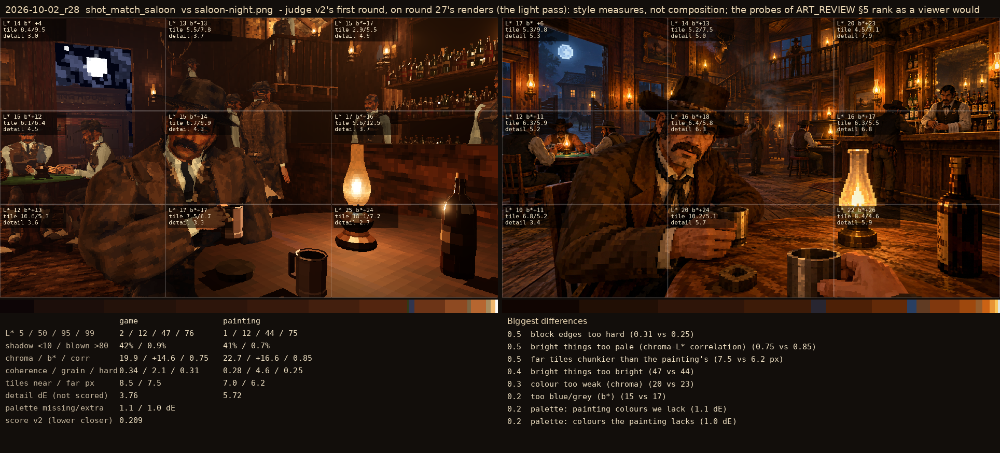
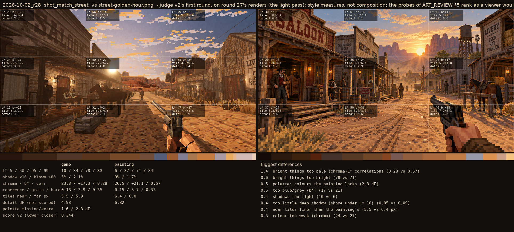

# 2026-10-02_r28: judge v2's first round, on round 27's renders (the light pass): style measures, not composition; the probes of ART_REVIEW §5 rank as a viewer would

## shot_match_saloon (score 0.209, lower is closer)

- 0.5 block edges too hard (0.31 vs 0.25)
- 0.5 bright things too pale (chroma-L* correlation) (0.75 vs 0.85)
- 0.5 far tiles chunkier than the painting's (7.5 vs 6.2 px)
- 0.4 bright things too bright (47 vs 44)
- 0.3 colour too weak (chroma) (20 vs 23)
- 0.2 too blue/grey (b*) (15 vs 17)
- 0.2 palette: painting colours we lack (1.1 dE)
- 0.2 palette: colours the painting lacks (1.0 dE)

## shot_match_street (score 0.344, lower is closer)

- 1.4 bright things too pale (chroma-L* correlation) (0.28 vs 0.57)
- 0.6 bright things too bright (78 vs 71)
- 0.5 palette: colours the painting lacks (2.8 dE)
- 0.5 too blue/grey (b*) (17 vs 21)
- 0.4 shadows too light (10 vs 6)
- 0.4 too little deep shadow (share under L* 10) (0.05 vs 0.09)
- 0.4 near tiles finer than the painting's (5.5 vs 6.4 px)
- 0.3 colour too weak (chroma) (24 vs 27)
