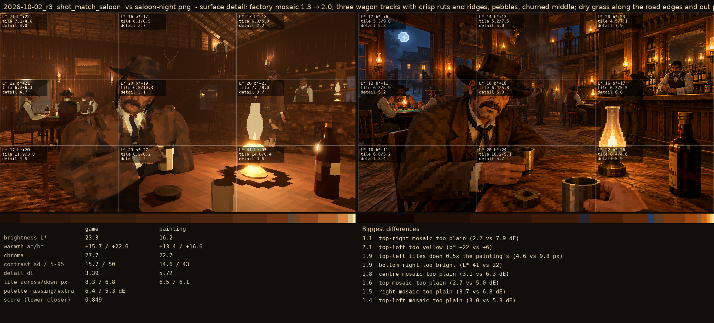
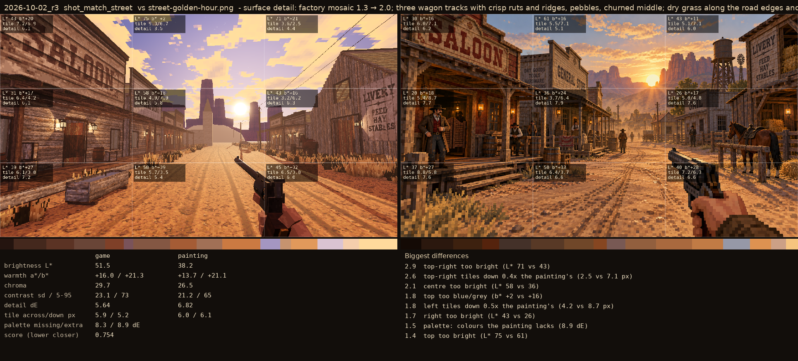

# 2026-10-02_r3: surface detail: factory mosaic 1.3 → 2.0; three wagon tracks with crisp ruts and ridges, pebbles, churned middle; dry grass along the road edges and out past town; a dark line along every board's edge

## shot_match_saloon (score 0.849, lower is closer)

- 3.1 top-right mosaic too plain (2.2 vs 7.9 dE)
- 2.1 top-left too yellow (b* +22 vs +6)
- 1.9 top-left tiles down 0.5x the painting's (4.6 vs 9.8 px)
- 1.9 bottom-right too bright (L* 41 vs 22)
- 1.8 centre mosaic too plain (3.1 vs 6.3 dE)
- 1.6 top mosaic too plain (2.7 vs 5.0 dE)
- 1.5 right mosaic too plain (3.7 vs 6.8 dE)
- 1.4 top-left mosaic too plain (3.0 vs 5.3 dE)

## shot_match_street (score 0.754, lower is closer)

- 2.9 top-right too bright (L* 71 vs 43)
- 2.6 top-right tiles down 0.4x the painting's (2.5 vs 7.1 px)
- 2.1 centre too bright (L* 58 vs 36)
- 1.8 top too blue/grey (b* +2 vs +16)
- 1.8 left tiles down 0.5x the painting's (4.2 vs 8.7 px)
- 1.7 right too bright (L* 43 vs 26)
- 1.5 palette: colours the painting lacks (8.9 dE)
- 1.4 top too bright (L* 75 vs 61)
