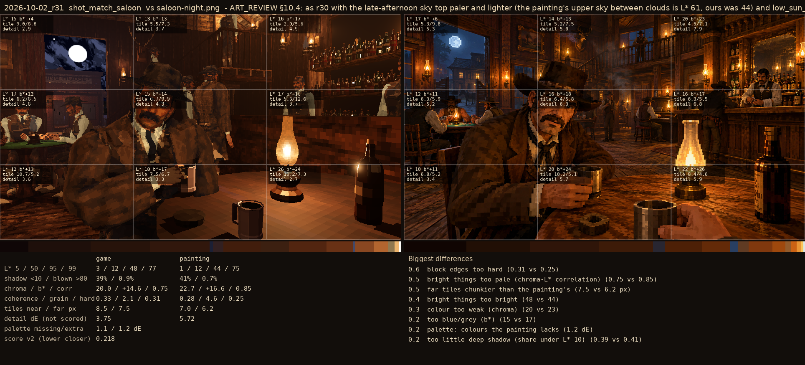
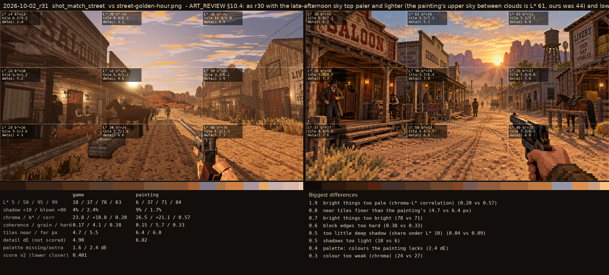

# 2026-10-02_r31: ART_REVIEW §10.4: as r30 with the late-afternoon sky top paler and lighter (the painting's upper sky between clouds is L* 61, ours was 44) and low_sun_dim 0.45 (saloon from r30)

## shot_match_saloon (score 0.218, lower is closer)

- 0.6 block edges too hard (0.31 vs 0.25)
- 0.5 bright things too pale (chroma-L* correlation) (0.75 vs 0.85)
- 0.5 far tiles chunkier than the painting's (7.5 vs 6.2 px)
- 0.4 bright things too bright (48 vs 44)
- 0.3 colour too weak (chroma) (20 vs 23)
- 0.2 too blue/grey (b*) (15 vs 17)
- 0.2 palette: colours the painting lacks (1.2 dE)
- 0.2 too little deep shadow (share under L* 10) (0.39 vs 0.41)

## shot_match_street (score 0.401, lower is closer)

- 1.9 bright things too pale (chroma-L* correlation) (0.20 vs 0.57)
- 0.8 near tiles finer than the painting's (4.7 vs 6.4 px)
- 0.7 bright things too bright (78 vs 71)
- 0.6 block edges too hard (0.38 vs 0.33)
- 0.5 too little deep shadow (share under L* 10) (0.04 vs 0.09)
- 0.5 shadows too light (10 vs 6)
- 0.4 palette: colours the painting lacks (2.4 dE)
- 0.3 colour too weak (chroma) (24 vs 27)
