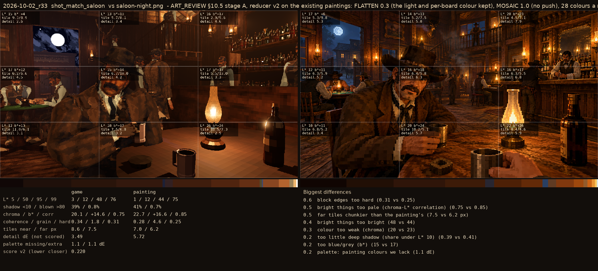
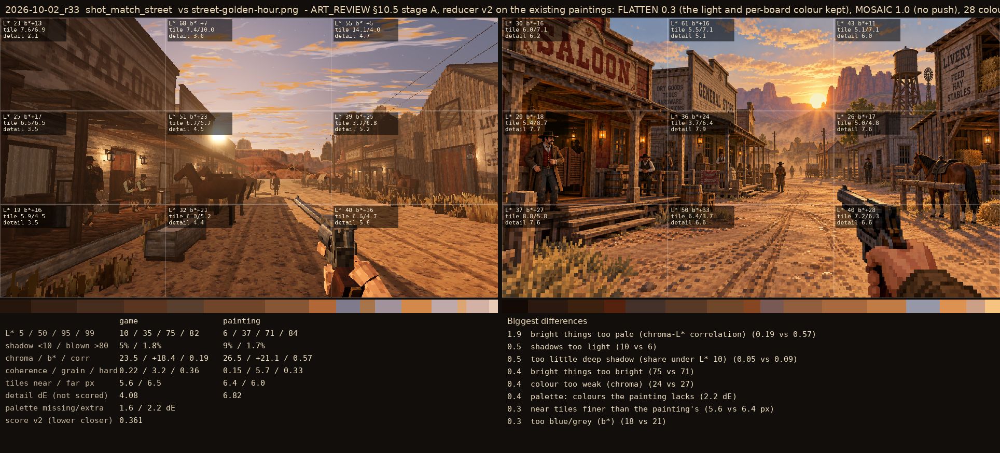

# 2026-10-02_r33: ART_REVIEW §10.5 stage A, reducer v2 on the existing paintings: FLATTEN 0.3 (the light and per-board colour kept), MOSAIC 1.0 (no push), 28 colours a material (32 the road)

## shot_match_saloon (score 0.220, lower is closer)

- 0.6 block edges too hard (0.31 vs 0.25)
- 0.5 bright things too pale (chroma-L* correlation) (0.75 vs 0.85)
- 0.5 far tiles chunkier than the painting's (7.5 vs 6.2 px)
- 0.4 bright things too bright (48 vs 44)
- 0.3 colour too weak (chroma) (20 vs 23)
- 0.2 too little deep shadow (share under L* 10) (0.39 vs 0.41)
- 0.2 too blue/grey (b*) (15 vs 17)
- 0.2 palette: painting colours we lack (1.1 dE)

## shot_match_street (score 0.361, lower is closer)

- 1.9 bright things too pale (chroma-L* correlation) (0.19 vs 0.57)
- 0.5 shadows too light (10 vs 6)
- 0.5 too little deep shadow (share under L* 10) (0.05 vs 0.09)
- 0.4 bright things too bright (75 vs 71)
- 0.4 colour too weak (chroma) (24 vs 27)
- 0.4 palette: colours the painting lacks (2.2 dE)
- 0.3 near tiles finer than the painting's (5.6 vs 6.4 px)
- 0.3 too blue/grey (b*) (18 vs 21)
