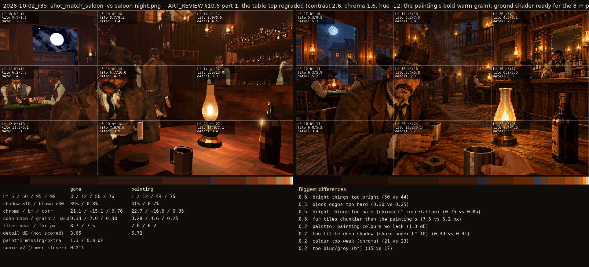
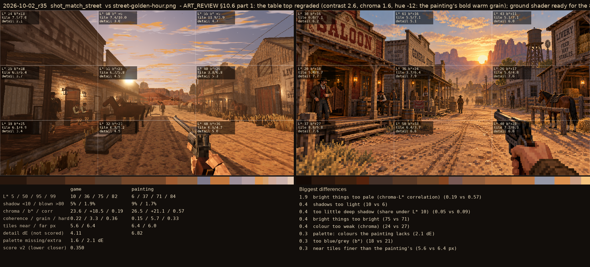

# 2026-10-02_r35: ART_REVIEW §10.6 part 1: the table top regraded (contrast 2.6, chroma 1.6, hue -12: the painting's bold warm grain); ground shader ready for the 8 m painted street (not painted yet)

## shot_match_saloon (score 0.211, lower is closer)

- 0.6 bright things too bright (50 vs 44)
- 0.5 block edges too hard (0.30 vs 0.25)
- 0.5 bright things too pale (chroma-L* correlation) (0.76 vs 0.85)
- 0.5 far tiles chunkier than the painting's (7.5 vs 6.2 px)
- 0.2 palette: painting colours we lack (1.3 dE)
- 0.2 too little deep shadow (share under L* 10) (0.39 vs 0.41)
- 0.2 colour too weak (chroma) (21 vs 23)
- 0.2 too blue/grey (b*) (15 vs 17)

## shot_match_street (score 0.350, lower is closer)

- 1.9 bright things too pale (chroma-L* correlation) (0.19 vs 0.57)
- 0.4 shadows too light (10 vs 6)
- 0.4 too little deep shadow (share under L* 10) (0.05 vs 0.09)
- 0.4 bright things too bright (75 vs 71)
- 0.4 colour too weak (chroma) (24 vs 27)
- 0.3 palette: colours the painting lacks (2.1 dE)
- 0.3 too blue/grey (b*) (18 vs 21)
- 0.3 near tiles finer than the painting's (5.6 vs 6.4 px)
