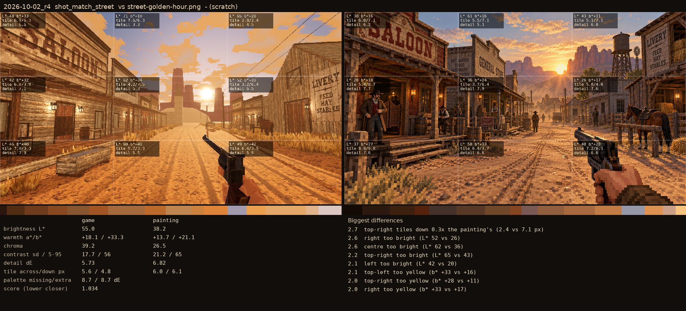

# 2026-10-02_r4: (scratch)

## shot_match_street (score 1.034, lower is closer)

- 2.7 top-right tiles down 0.3x the painting's (2.4 vs 7.1 px)
- 2.6 right too bright (L* 52 vs 26)
- 2.6 centre too bright (L* 62 vs 36)
- 2.2 top-right too bright (L* 65 vs 43)
- 2.1 left too bright (L* 42 vs 20)
- 2.1 top-left too yellow (b* +33 vs +16)
- 2.0 top-right too yellow (b* +28 vs +11)
- 2.0 right too yellow (b* +33 vs +17)
