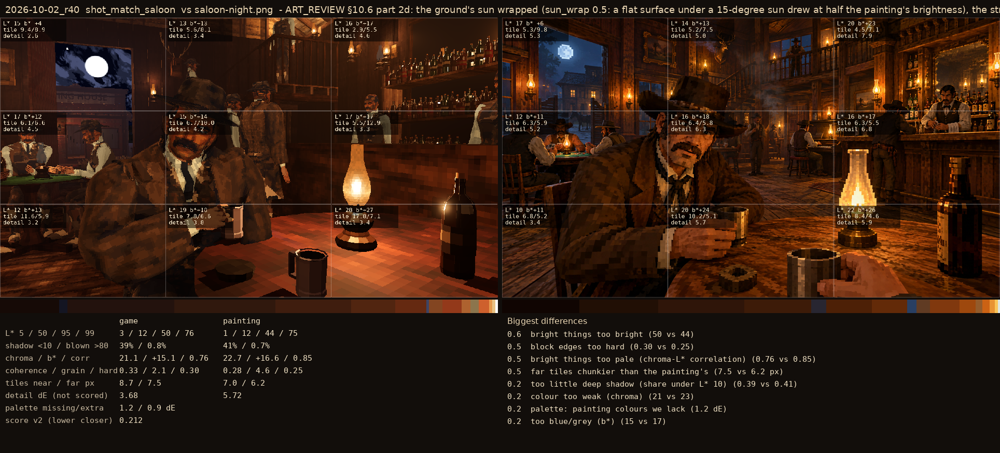
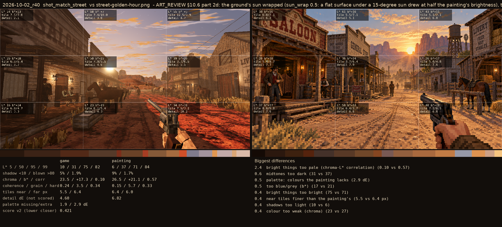

# 2026-10-02_r40: ART_REVIEW §10.6 part 2d: the ground's sun wrapped (sun_wrap 0.5: a flat surface under a 15-degree sun drew at half the painting's brightness), the street tiles at the painting's albedo again

## shot_match_saloon (score 0.212, lower is closer)

- 0.6 bright things too bright (50 vs 44)
- 0.5 block edges too hard (0.30 vs 0.25)
- 0.5 bright things too pale (chroma-L* correlation) (0.76 vs 0.85)
- 0.5 far tiles chunkier than the painting's (7.5 vs 6.2 px)
- 0.2 too little deep shadow (share under L* 10) (0.39 vs 0.41)
- 0.2 colour too weak (chroma) (21 vs 23)
- 0.2 palette: painting colours we lack (1.2 dE)
- 0.2 too blue/grey (b*) (15 vs 17)

## shot_match_street (score 0.421, lower is closer)

- 2.4 bright things too pale (chroma-L* correlation) (0.10 vs 0.57)
- 0.6 midtones too dark (31 vs 37)
- 0.5 palette: colours the painting lacks (2.9 dE)
- 0.5 too blue/grey (b*) (17 vs 21)
- 0.4 bright things too bright (75 vs 71)
- 0.4 near tiles finer than the painting's (5.5 vs 6.4 px)
- 0.4 shadows too light (10 vs 6)
- 0.4 colour too weak (chroma) (23 vs 27)
