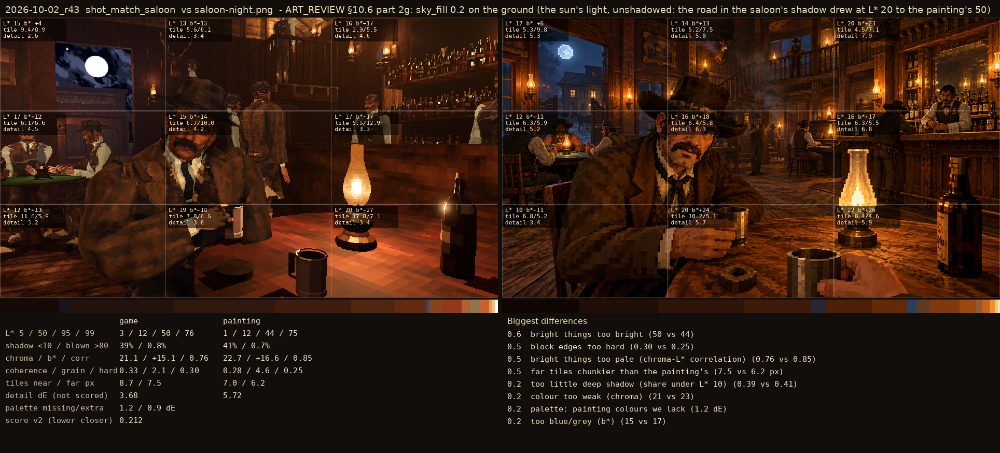
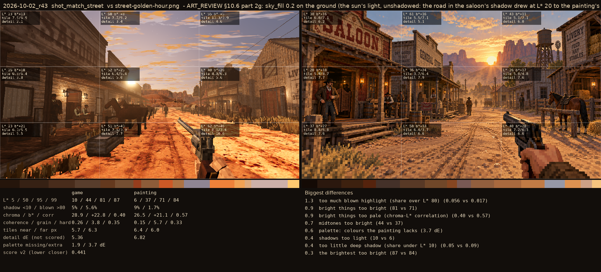

# 2026-10-02_r43: ART_REVIEW §10.6 part 2g: sky_fill 0.2 on the ground (the sun's light, unshadowed: the road in the saloon's shadow drew at L* 20 to the painting's 50)

## shot_match_saloon (score 0.212, lower is closer)

- 0.6 bright things too bright (50 vs 44)
- 0.5 block edges too hard (0.30 vs 0.25)
- 0.5 bright things too pale (chroma-L* correlation) (0.76 vs 0.85)
- 0.5 far tiles chunkier than the painting's (7.5 vs 6.2 px)
- 0.2 too little deep shadow (share under L* 10) (0.39 vs 0.41)
- 0.2 colour too weak (chroma) (21 vs 23)
- 0.2 palette: painting colours we lack (1.2 dE)
- 0.2 too blue/grey (b*) (15 vs 17)

## shot_match_street (score 0.441, lower is closer)

- 1.3 too much blown highlight (share over L* 80) (0.056 vs 0.017)
- 0.9 bright things too bright (81 vs 71)
- 0.9 bright things too pale (chroma-L* correlation) (0.40 vs 0.57)
- 0.7 midtones too bright (44 vs 37)
- 0.6 palette: colours the painting lacks (3.7 dE)
- 0.4 shadows too light (10 vs 6)
- 0.4 too little deep shadow (share under L* 10) (0.05 vs 0.09)
- 0.3 the brightest too bright (87 vs 84)
