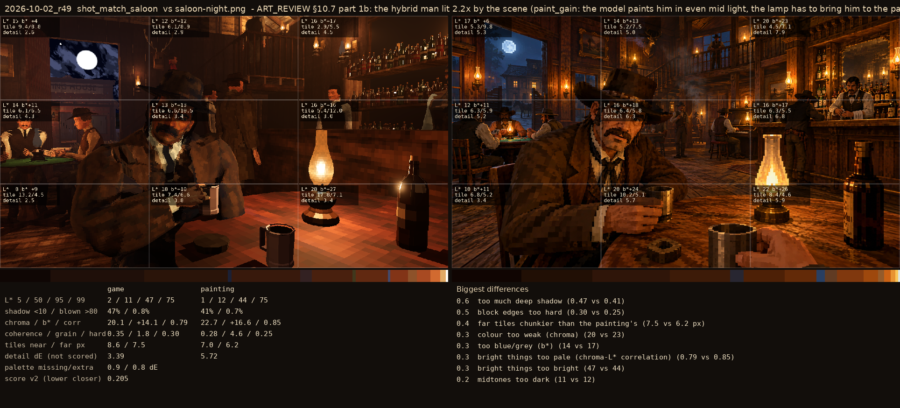
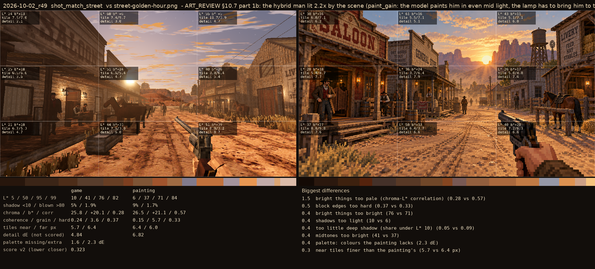

# 2026-10-02_r49: ART_REVIEW §10.7 part 1b: the hybrid man lit 2.2x by the scene (paint_gain: the model paints him in even mid light, the lamp has to bring him to the painting's)

## shot_match_saloon (score 0.205, lower is closer)

- 0.6 too much deep shadow (0.47 vs 0.41)
- 0.5 block edges too hard (0.30 vs 0.25)
- 0.4 far tiles chunkier than the painting's (7.5 vs 6.2 px)
- 0.3 colour too weak (chroma) (20 vs 23)
- 0.3 too blue/grey (b*) (14 vs 17)
- 0.3 bright things too pale (chroma-L* correlation) (0.79 vs 0.85)
- 0.3 bright things too bright (47 vs 44)
- 0.2 midtones too dark (11 vs 12)

## shot_match_street (score 0.323, lower is closer)

- 1.5 bright things too pale (chroma-L* correlation) (0.28 vs 0.57)
- 0.5 block edges too hard (0.37 vs 0.33)
- 0.4 bright things too bright (76 vs 71)
- 0.4 shadows too light (10 vs 6)
- 0.4 too little deep shadow (share under L* 10) (0.05 vs 0.09)
- 0.4 midtones too bright (41 vs 37)
- 0.4 palette: colours the painting lacks (2.3 dE)
- 0.3 near tiles finer than the painting's (5.7 vs 6.4 px)
