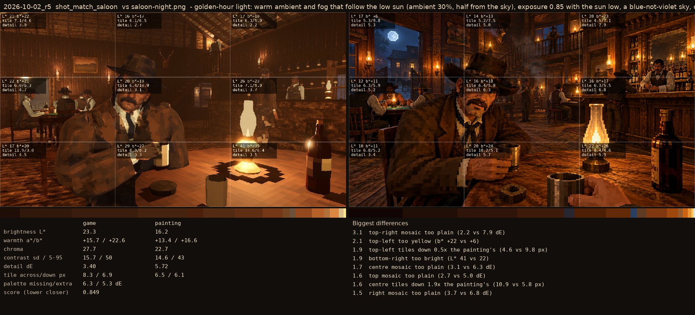
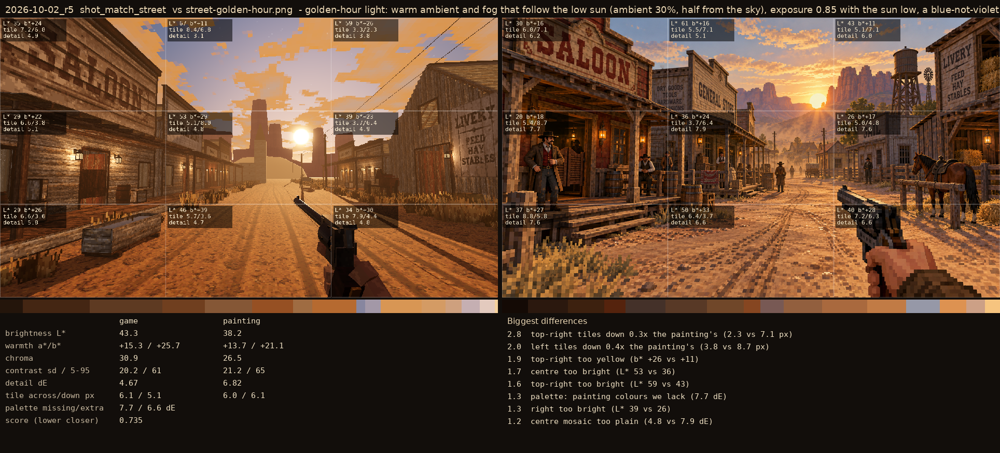

# 2026-10-02_r5: golden-hour light: warm ambient and fog that follow the low sun (ambient 30%, half from the sky), exposure 0.85 with the sun low, a blue-not-violet sky, orange clouds, gold sun; wall lanterns without shadows

## shot_match_saloon (score 0.849, lower is closer)

- 3.1 top-right mosaic too plain (2.2 vs 7.9 dE)
- 2.1 top-left too yellow (b* +22 vs +6)
- 1.9 top-left tiles down 0.5x the painting's (4.6 vs 9.8 px)
- 1.9 bottom-right too bright (L* 41 vs 22)
- 1.7 centre mosaic too plain (3.1 vs 6.3 dE)
- 1.6 top mosaic too plain (2.7 vs 5.0 dE)
- 1.6 centre tiles down 1.9x the painting's (10.9 vs 5.8 px)
- 1.5 right mosaic too plain (3.7 vs 6.8 dE)

## shot_match_street (score 0.735, lower is closer)

- 2.8 top-right tiles down 0.3x the painting's (2.3 vs 7.1 px)
- 2.0 left tiles down 0.4x the painting's (3.8 vs 8.7 px)
- 1.9 top-right too yellow (b* +26 vs +11)
- 1.7 centre too bright (L* 53 vs 36)
- 1.6 top-right too bright (L* 59 vs 43)
- 1.3 palette: painting colours we lack (7.7 dE)
- 1.3 right too bright (L* 39 vs 26)
- 1.2 centre mosaic too plain (4.8 vs 7.9 dE)
