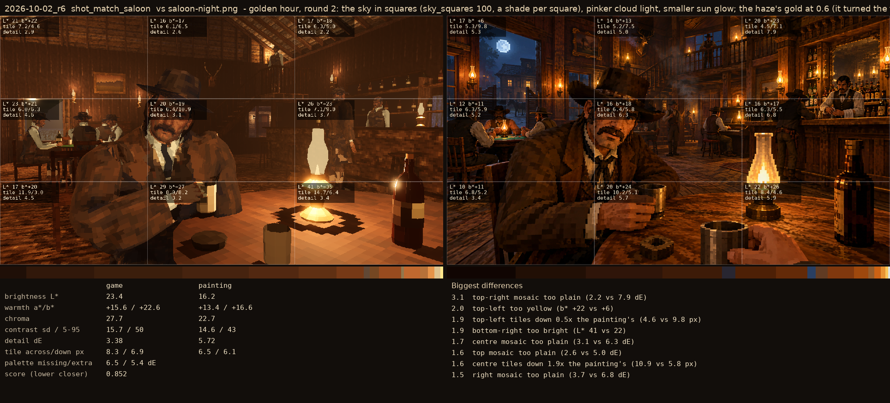
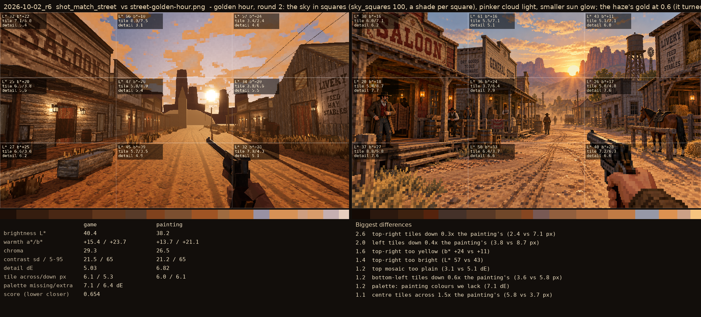

# 2026-10-02_r6: golden hour, round 2: the sky in squares (sky_squares 100, a shade per square), pinker cloud light, smaller sun glow; the haze's gold at 0.6 (it turned the far hills cream); the placeholder church weathered wood

## shot_match_saloon (score 0.852, lower is closer)

- 3.1 top-right mosaic too plain (2.2 vs 7.9 dE)
- 2.0 top-left too yellow (b* +22 vs +6)
- 1.9 top-left tiles down 0.5x the painting's (4.6 vs 9.8 px)
- 1.9 bottom-right too bright (L* 41 vs 22)
- 1.7 centre mosaic too plain (3.1 vs 6.3 dE)
- 1.6 top mosaic too plain (2.6 vs 5.0 dE)
- 1.6 centre tiles down 1.9x the painting's (10.9 vs 5.8 px)
- 1.5 right mosaic too plain (3.7 vs 6.8 dE)

## shot_match_street (score 0.654, lower is closer)

- 2.6 top-right tiles down 0.3x the painting's (2.4 vs 7.1 px)
- 2.0 left tiles down 0.4x the painting's (3.8 vs 8.7 px)
- 1.6 top-right too yellow (b* +24 vs +11)
- 1.4 top-right too bright (L* 57 vs 43)
- 1.2 top mosaic too plain (3.1 vs 5.1 dE)
- 1.2 bottom-left tiles down 0.6x the painting's (3.6 vs 5.8 px)
- 1.2 palette: painting colours we lack (7.1 dE)
- 1.1 centre tiles across 1.5x the painting's (5.8 vs 3.7 px)
