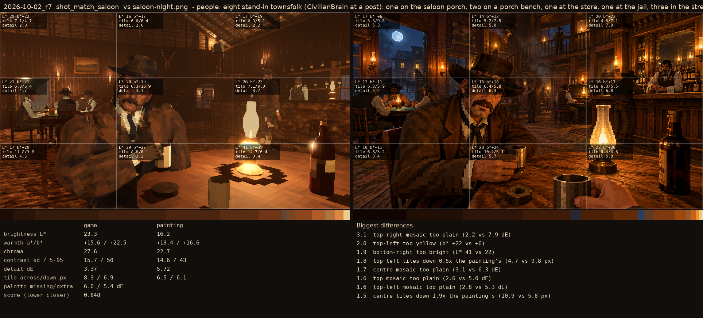
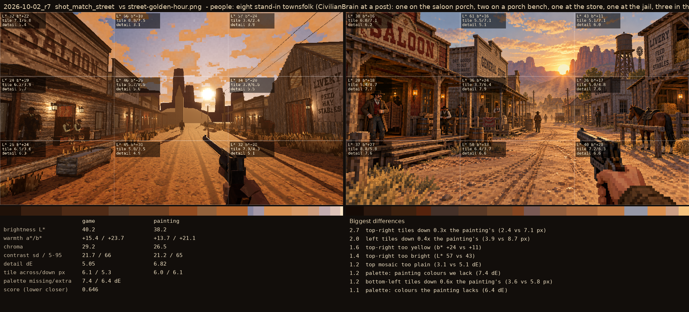

# 2026-10-02_r7: people: eight stand-in townsfolk (CivilianBrain at a post): one on the saloon porch, two on a porch bench, one at the store, one at the jail, three in the street

## shot_match_saloon (score 0.848, lower is closer)

- 3.1 top-right mosaic too plain (2.2 vs 7.9 dE)
- 2.0 top-left too yellow (b* +22 vs +6)
- 1.9 bottom-right too bright (L* 41 vs 22)
- 1.8 top-left tiles down 0.5x the painting's (4.7 vs 9.8 px)
- 1.7 centre mosaic too plain (3.1 vs 6.3 dE)
- 1.6 top mosaic too plain (2.6 vs 5.0 dE)
- 1.6 top-left mosaic too plain (2.8 vs 5.3 dE)
- 1.5 centre tiles down 1.9x the painting's (10.9 vs 5.8 px)

## shot_match_street (score 0.646, lower is closer)

- 2.7 top-right tiles down 0.3x the painting's (2.4 vs 7.1 px)
- 2.0 left tiles down 0.4x the painting's (3.9 vs 8.7 px)
- 1.6 top-right too yellow (b* +24 vs +11)
- 1.4 top-right too bright (L* 57 vs 43)
- 1.2 top mosaic too plain (3.1 vs 5.1 dE)
- 1.2 palette: painting colours we lack (7.4 dE)
- 1.2 bottom-left tiles down 0.6x the painting's (3.6 vs 5.8 px)
- 1.1 palette: colours the painting lacks (6.4 dE)
