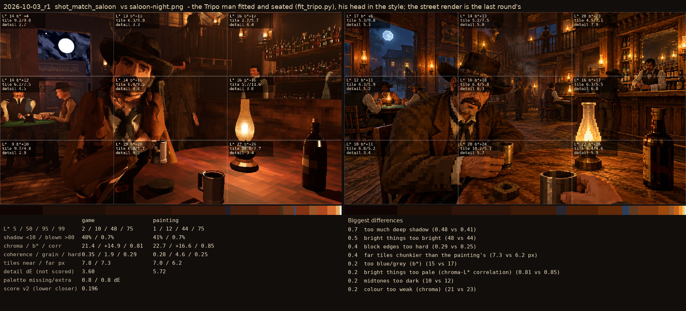
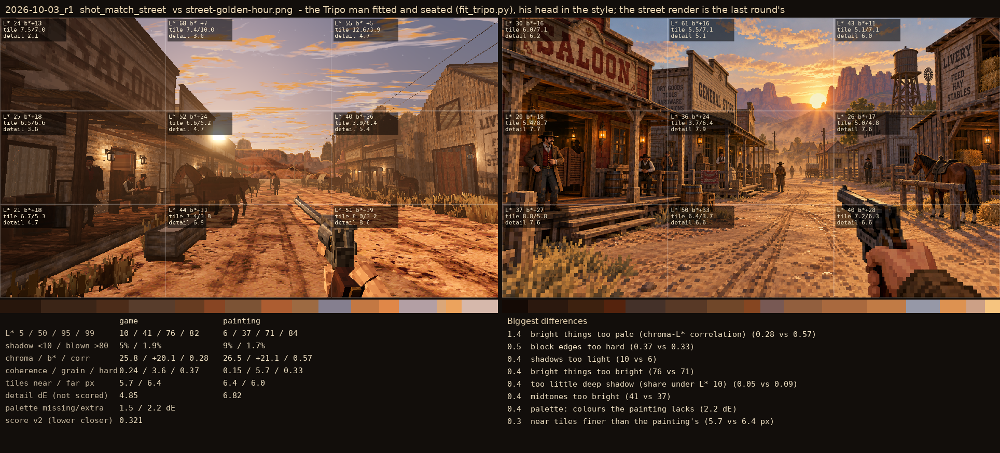

# 2026-10-03_r1: the Tripo man fitted and seated (fit_tripo.py), his head in the style; the street render is the last round's

## shot_match_saloon (score 0.196, lower is closer)

- 0.7 too much deep shadow (0.48 vs 0.41)
- 0.5 bright things too bright (48 vs 44)
- 0.4 block edges too hard (0.29 vs 0.25)
- 0.4 far tiles chunkier than the painting's (7.3 vs 6.2 px)
- 0.2 too blue/grey (b*) (15 vs 17)
- 0.2 bright things too pale (chroma-L* correlation) (0.81 vs 0.85)
- 0.2 midtones too dark (10 vs 12)
- 0.2 colour too weak (chroma) (21 vs 23)

## shot_match_street (score 0.321, lower is closer)

- 1.4 bright things too pale (chroma-L* correlation) (0.28 vs 0.57)
- 0.5 block edges too hard (0.37 vs 0.33)
- 0.4 shadows too light (10 vs 6)
- 0.4 bright things too bright (76 vs 71)
- 0.4 too little deep shadow (share under L* 10) (0.05 vs 0.09)
- 0.4 midtones too bright (41 vs 37)
- 0.4 palette: colours the painting lacks (2.2 dE)
- 0.3 near tiles finer than the painting's (5.7 vs 6.4 px)
