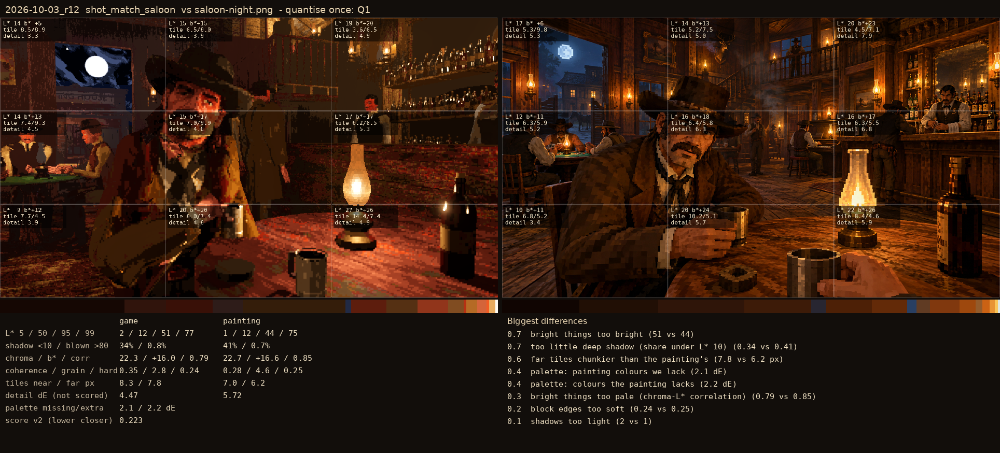
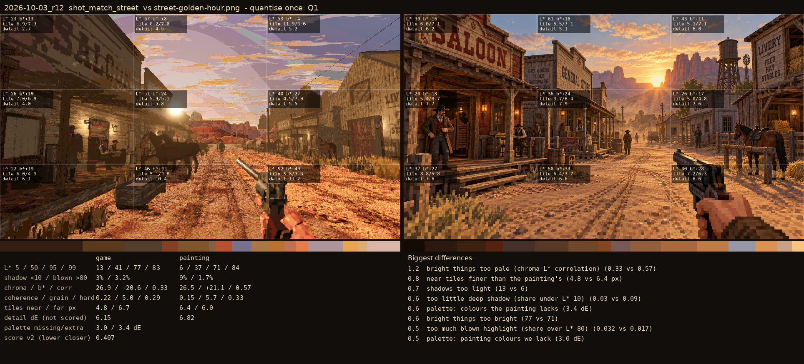

# 2026-10-03_r12: quantise once: Q1

## shot_match_saloon (score 0.223, lower is closer)

- 0.7 bright things too bright (51 vs 44)
- 0.7 too little deep shadow (share under L* 10) (0.34 vs 0.41)
- 0.6 far tiles chunkier than the painting's (7.8 vs 6.2 px)
- 0.4 palette: painting colours we lack (2.1 dE)
- 0.4 palette: colours the painting lacks (2.2 dE)
- 0.3 bright things too pale (chroma-L* correlation) (0.79 vs 0.85)
- 0.2 block edges too soft (0.24 vs 0.25)
- 0.1 shadows too light (2 vs 1)

## shot_match_street (score 0.407, lower is closer)

- 1.2 bright things too pale (chroma-L* correlation) (0.33 vs 0.57)
- 0.8 near tiles finer than the painting's (4.8 vs 6.4 px)
- 0.7 shadows too light (13 vs 6)
- 0.6 too little deep shadow (share under L* 10) (0.03 vs 0.09)
- 0.6 palette: colours the painting lacks (3.4 dE)
- 0.6 bright things too bright (77 vs 71)
- 0.5 too much blown highlight (share over L* 80) (0.032 vs 0.017)
- 0.5 palette: painting colours we lack (3.0 dE)
