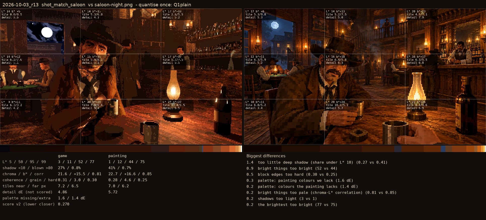
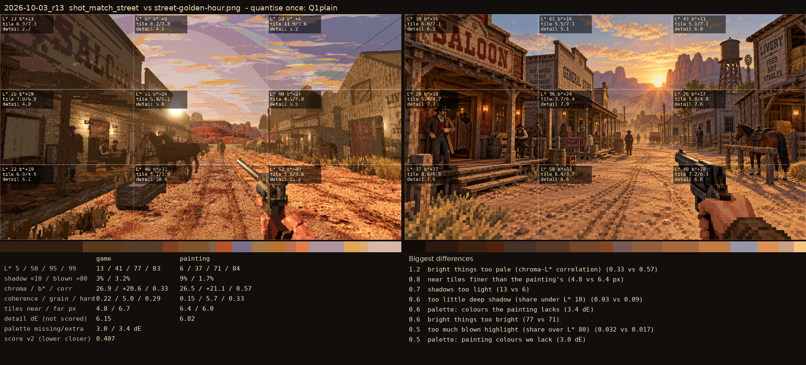

# 2026-10-03_r13: quantise once: Q1plain

## shot_match_saloon (score 0.270, lower is closer)

- 1.4 too little deep shadow (share under L* 10) (0.27 vs 0.41)
- 0.9 bright things too bright (52 vs 44)
- 0.5 block edges too hard (0.30 vs 0.25)
- 0.3 palette: painting colours we lack (1.6 dE)
- 0.2 palette: colours the painting lacks (1.4 dE)
- 0.2 bright things too pale (chroma-L* correlation) (0.81 vs 0.85)
- 0.2 shadows too light (3 vs 1)
- 0.2 the brightest too bright (77 vs 75)

## shot_match_street (score 0.407, lower is closer)

- 1.2 bright things too pale (chroma-L* correlation) (0.33 vs 0.57)
- 0.8 near tiles finer than the painting's (4.8 vs 6.4 px)
- 0.7 shadows too light (13 vs 6)
- 0.6 too little deep shadow (share under L* 10) (0.03 vs 0.09)
- 0.6 palette: colours the painting lacks (3.4 dE)
- 0.6 bright things too bright (77 vs 71)
- 0.5 too much blown highlight (share over L* 80) (0.032 vs 0.017)
- 0.5 palette: painting colours we lack (3.0 dE)
