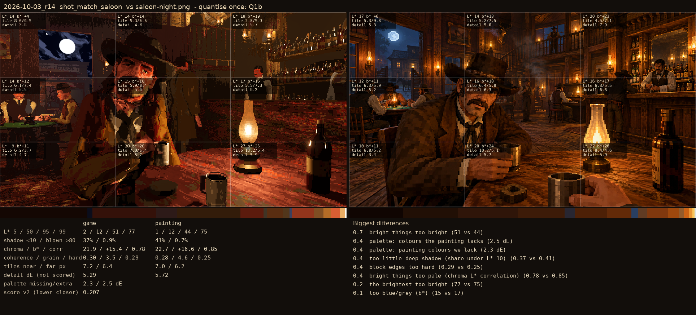
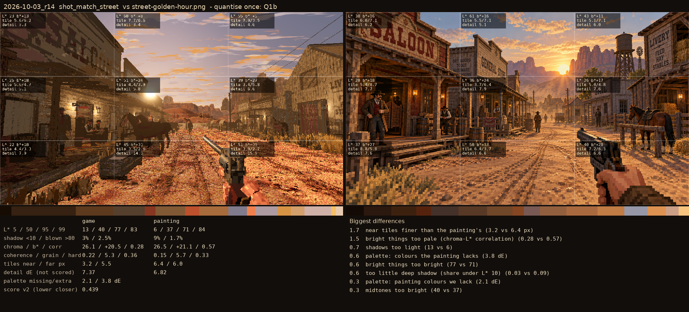

# 2026-10-03_r14: quantise once: Q1b

## shot_match_saloon (score 0.207, lower is closer)

- 0.7 bright things too bright (51 vs 44)
- 0.4 palette: colours the painting lacks (2.5 dE)
- 0.4 palette: painting colours we lack (2.3 dE)
- 0.4 too little deep shadow (share under L* 10) (0.37 vs 0.41)
- 0.4 block edges too hard (0.29 vs 0.25)
- 0.4 bright things too pale (chroma-L* correlation) (0.78 vs 0.85)
- 0.2 the brightest too bright (77 vs 75)
- 0.1 too blue/grey (b*) (15 vs 17)

## shot_match_street (score 0.439, lower is closer)

- 1.7 near tiles finer than the painting's (3.2 vs 6.4 px)
- 1.5 bright things too pale (chroma-L* correlation) (0.28 vs 0.57)
- 0.7 shadows too light (13 vs 6)
- 0.6 palette: colours the painting lacks (3.8 dE)
- 0.6 bright things too bright (77 vs 71)
- 0.6 too little deep shadow (share under L* 10) (0.03 vs 0.09)
- 0.3 palette: painting colours we lack (2.1 dE)
- 0.3 midtones too bright (40 vs 37)
