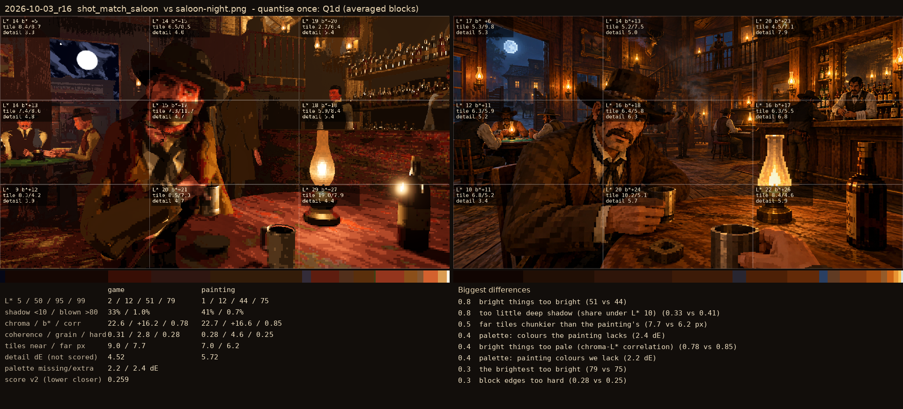
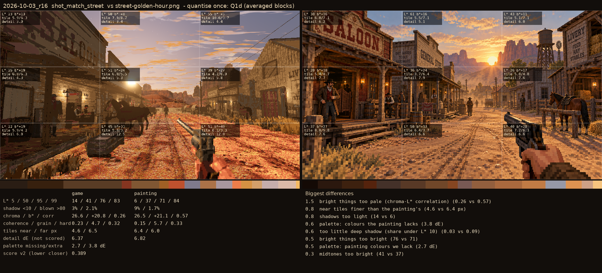

# 2026-10-03_r16: quantise once: Q1d (averaged blocks)

## shot_match_saloon (score 0.259, lower is closer)

- 0.8 bright things too bright (51 vs 44)
- 0.8 too little deep shadow (share under L* 10) (0.33 vs 0.41)
- 0.5 far tiles chunkier than the painting's (7.7 vs 6.2 px)
- 0.4 palette: colours the painting lacks (2.4 dE)
- 0.4 bright things too pale (chroma-L* correlation) (0.78 vs 0.85)
- 0.4 palette: painting colours we lack (2.2 dE)
- 0.3 the brightest too bright (79 vs 75)
- 0.3 block edges too hard (0.28 vs 0.25)

## shot_match_street (score 0.389, lower is closer)

- 1.5 bright things too pale (chroma-L* correlation) (0.26 vs 0.57)
- 0.8 near tiles finer than the painting's (4.6 vs 6.4 px)
- 0.8 shadows too light (14 vs 6)
- 0.6 palette: colours the painting lacks (3.8 dE)
- 0.6 too little deep shadow (share under L* 10) (0.03 vs 0.09)
- 0.5 bright things too bright (76 vs 71)
- 0.5 palette: painting colours we lack (2.7 dE)
- 0.3 midtones too bright (41 vs 37)
