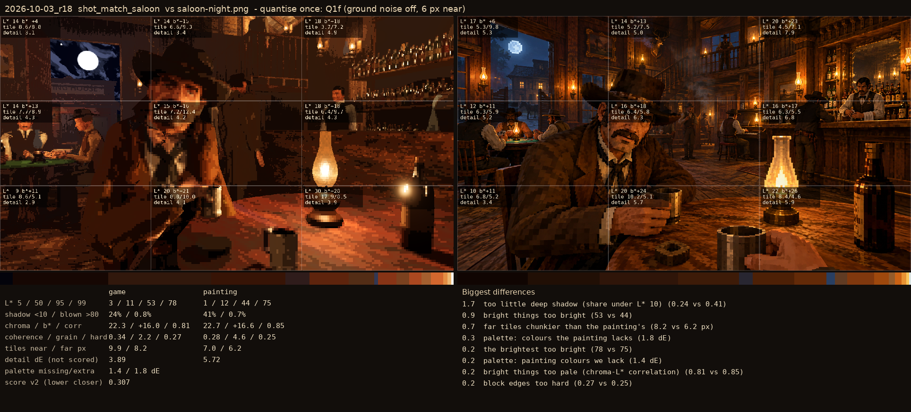
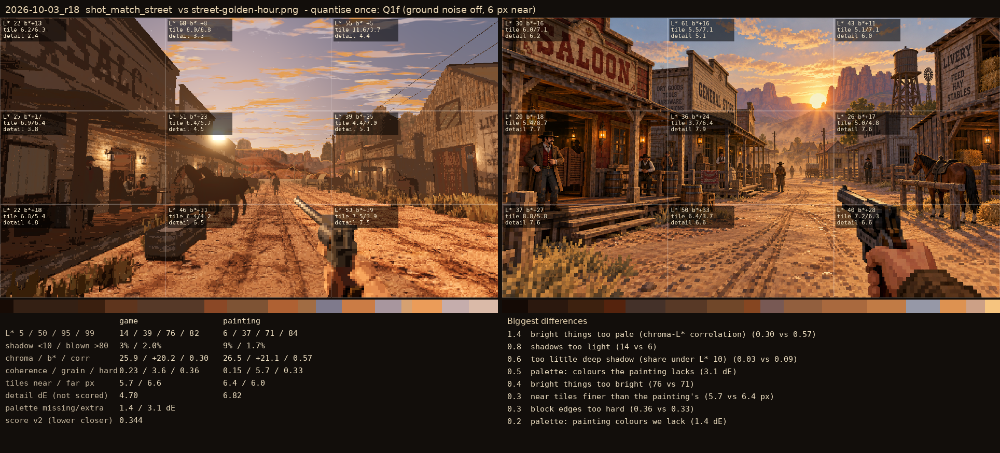

# 2026-10-03_r18: quantise once: Q1f (ground noise off, 6 px near)

## shot_match_saloon (score 0.307, lower is closer)

- 1.7 too little deep shadow (share under L* 10) (0.24 vs 0.41)
- 0.9 bright things too bright (53 vs 44)
- 0.7 far tiles chunkier than the painting's (8.2 vs 6.2 px)
- 0.3 palette: colours the painting lacks (1.8 dE)
- 0.2 the brightest too bright (78 vs 75)
- 0.2 palette: painting colours we lack (1.4 dE)
- 0.2 bright things too pale (chroma-L* correlation) (0.81 vs 0.85)
- 0.2 block edges too hard (0.27 vs 0.25)

## shot_match_street (score 0.344, lower is closer)

- 1.4 bright things too pale (chroma-L* correlation) (0.30 vs 0.57)
- 0.8 shadows too light (14 vs 6)
- 0.6 too little deep shadow (share under L* 10) (0.03 vs 0.09)
- 0.5 palette: colours the painting lacks (3.1 dE)
- 0.4 bright things too bright (76 vs 71)
- 0.3 near tiles finer than the painting's (5.7 vs 6.4 px)
- 0.3 block edges too hard (0.36 vs 0.33)
- 0.2 palette: painting colours we lack (1.4 dE)
