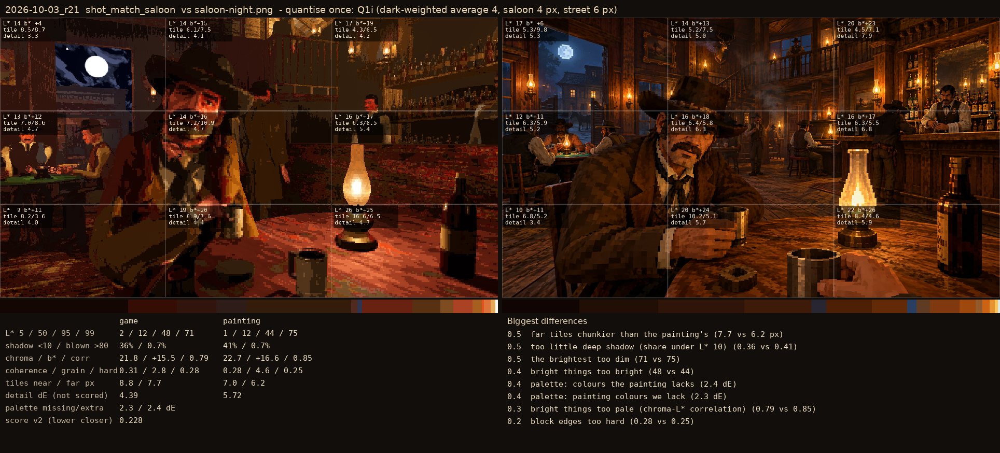
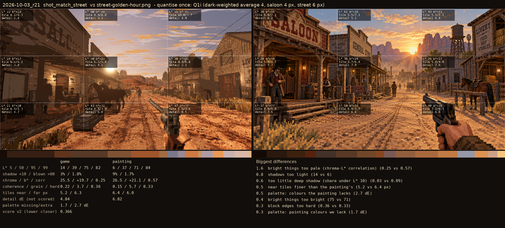

# 2026-10-03_r21: quantise once: Q1i (dark-weighted average 4, saloon 4 px, street 6 px)

## shot_match_saloon (score 0.228, lower is closer)

- 0.5 far tiles chunkier than the painting's (7.7 vs 6.2 px)
- 0.5 too little deep shadow (share under L* 10) (0.36 vs 0.41)
- 0.5 the brightest too dim (71 vs 75)
- 0.4 bright things too bright (48 vs 44)
- 0.4 palette: colours the painting lacks (2.4 dE)
- 0.4 palette: painting colours we lack (2.3 dE)
- 0.3 bright things too pale (chroma-L* correlation) (0.79 vs 0.85)
- 0.2 block edges too hard (0.28 vs 0.25)

## shot_match_street (score 0.366, lower is closer)

- 1.6 bright things too pale (chroma-L* correlation) (0.25 vs 0.57)
- 0.8 shadows too light (14 vs 6)
- 0.6 too little deep shadow (share under L* 10) (0.03 vs 0.09)
- 0.5 near tiles finer than the painting's (5.2 vs 6.4 px)
- 0.5 palette: colours the painting lacks (2.7 dE)
- 0.4 bright things too bright (75 vs 71)
- 0.3 block edges too hard (0.36 vs 0.33)
- 0.3 palette: painting colours we lack (1.7 dE)
