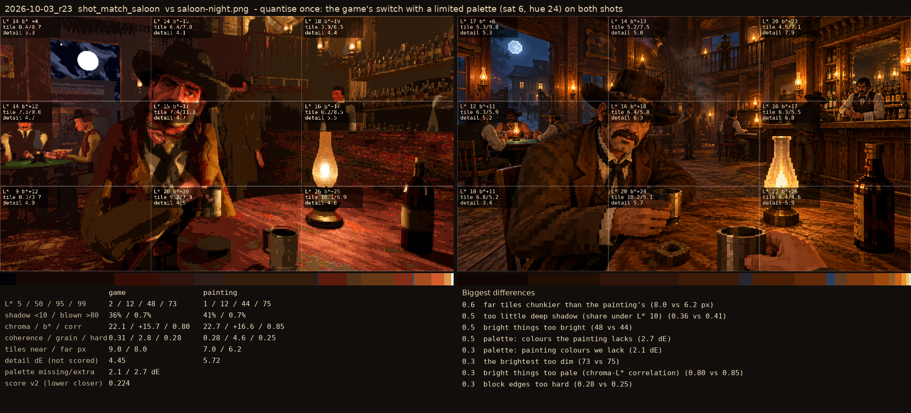
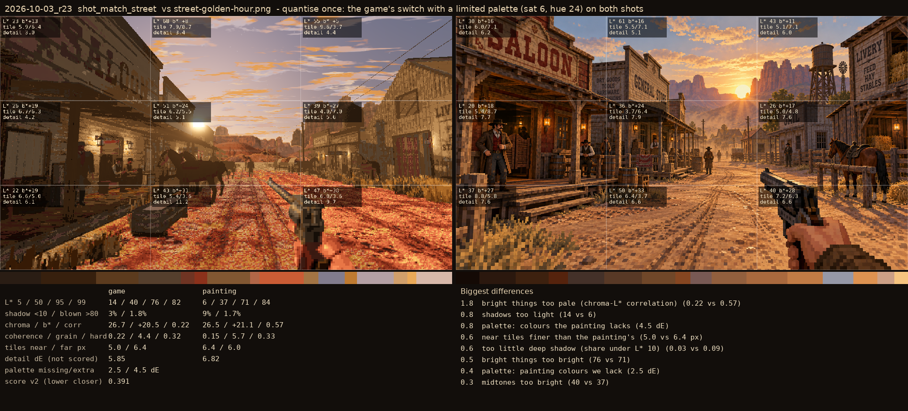

# 2026-10-03_r23: quantise once: the game's switch with a limited palette (sat 6, hue 24) on both shots

## shot_match_saloon (score 0.224, lower is closer)

- 0.6 far tiles chunkier than the painting's (8.0 vs 6.2 px)
- 0.5 too little deep shadow (share under L* 10) (0.36 vs 0.41)
- 0.5 bright things too bright (48 vs 44)
- 0.5 palette: colours the painting lacks (2.7 dE)
- 0.3 palette: painting colours we lack (2.1 dE)
- 0.3 the brightest too dim (73 vs 75)
- 0.3 bright things too pale (chroma-L* correlation) (0.80 vs 0.85)
- 0.3 block edges too hard (0.28 vs 0.25)

## shot_match_street (score 0.391, lower is closer)

- 1.8 bright things too pale (chroma-L* correlation) (0.22 vs 0.57)
- 0.8 shadows too light (14 vs 6)
- 0.8 palette: colours the painting lacks (4.5 dE)
- 0.6 near tiles finer than the painting's (5.0 vs 6.4 px)
- 0.6 too little deep shadow (share under L* 10) (0.03 vs 0.09)
- 0.5 bright things too bright (76 vs 71)
- 0.4 palette: painting colours we lack (2.5 dE)
- 0.3 midtones too bright (40 vs 37)
