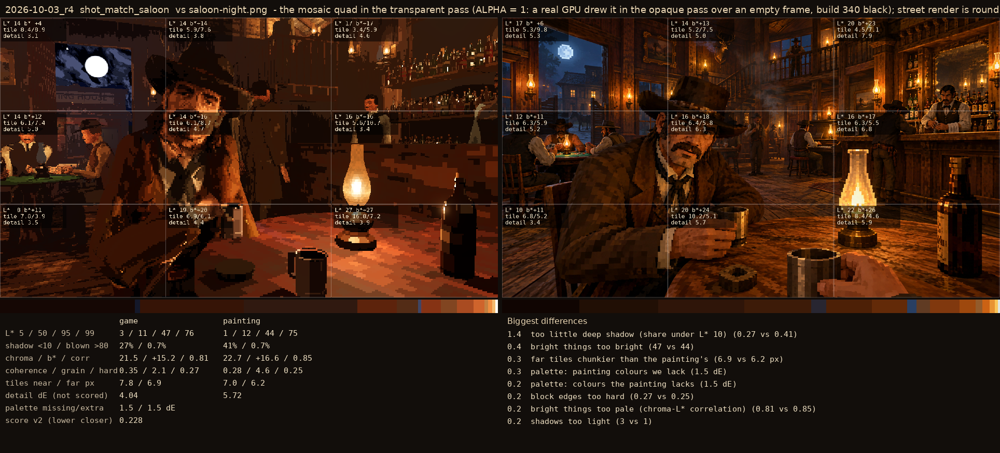
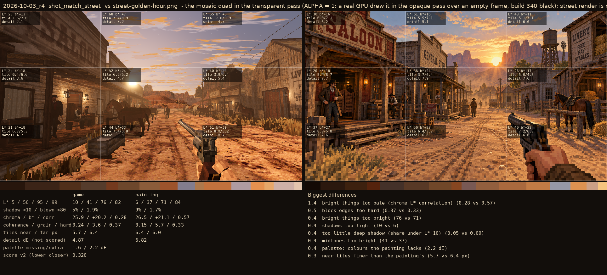

# 2026-10-03_r4: the mosaic quad in the transparent pass (ALPHA = 1: a real GPU drew it in the opaque pass over an empty frame, build 340 black); street render is round 3's

## shot_match_saloon (score 0.228, lower is closer)

- 1.4 too little deep shadow (share under L* 10) (0.27 vs 0.41)
- 0.4 bright things too bright (47 vs 44)
- 0.3 far tiles chunkier than the painting's (6.9 vs 6.2 px)
- 0.3 palette: painting colours we lack (1.5 dE)
- 0.2 palette: colours the painting lacks (1.5 dE)
- 0.2 block edges too hard (0.27 vs 0.25)
- 0.2 bright things too pale (chroma-L* correlation) (0.81 vs 0.85)
- 0.2 shadows too light (3 vs 1)

## shot_match_street (score 0.320, lower is closer)

- 1.4 bright things too pale (chroma-L* correlation) (0.28 vs 0.57)
- 0.5 block edges too hard (0.37 vs 0.33)
- 0.4 bright things too bright (76 vs 71)
- 0.4 shadows too light (10 vs 6)
- 0.4 too little deep shadow (share under L* 10) (0.05 vs 0.09)
- 0.4 midtones too bright (41 vs 37)
- 0.4 palette: colours the painting lacks (2.2 dE)
- 0.3 near tiles finer than the painting's (5.7 vs 6.4 px)
