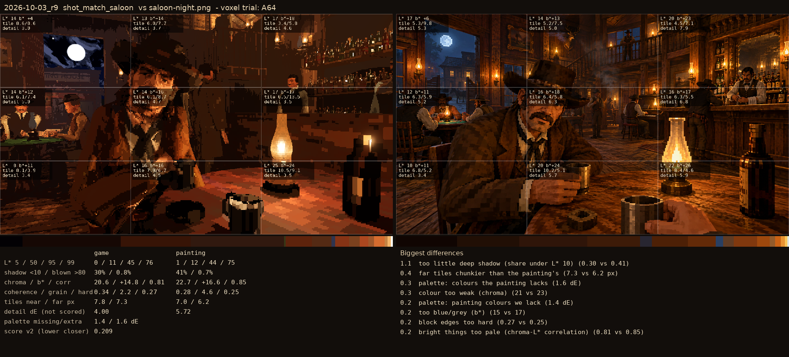
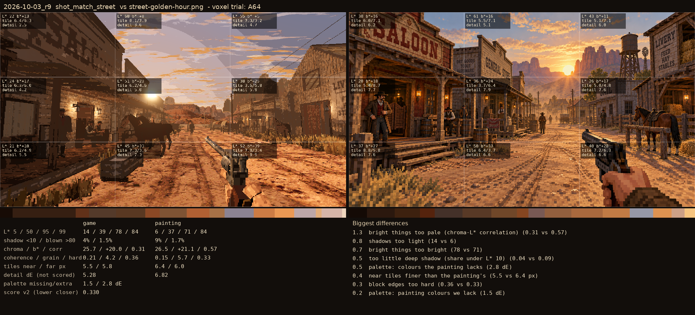

# 2026-10-03_r9: voxel trial: A64

## shot_match_saloon (score 0.209, lower is closer)

- 1.1 too little deep shadow (share under L* 10) (0.30 vs 0.41)
- 0.4 far tiles chunkier than the painting's (7.3 vs 6.2 px)
- 0.3 palette: colours the painting lacks (1.6 dE)
- 0.3 colour too weak (chroma) (21 vs 23)
- 0.2 palette: painting colours we lack (1.4 dE)
- 0.2 too blue/grey (b*) (15 vs 17)
- 0.2 block edges too hard (0.27 vs 0.25)
- 0.2 bright things too pale (chroma-L* correlation) (0.81 vs 0.85)

## shot_match_street (score 0.330, lower is closer)

- 1.3 bright things too pale (chroma-L* correlation) (0.31 vs 0.57)
- 0.8 shadows too light (14 vs 6)
- 0.7 bright things too bright (78 vs 71)
- 0.5 too little deep shadow (share under L* 10) (0.04 vs 0.09)
- 0.5 palette: colours the painting lacks (2.8 dE)
- 0.4 near tiles finer than the painting's (5.5 vs 6.4 px)
- 0.3 block edges too hard (0.36 vs 0.33)
- 0.2 palette: painting colours we lack (1.5 dE)
