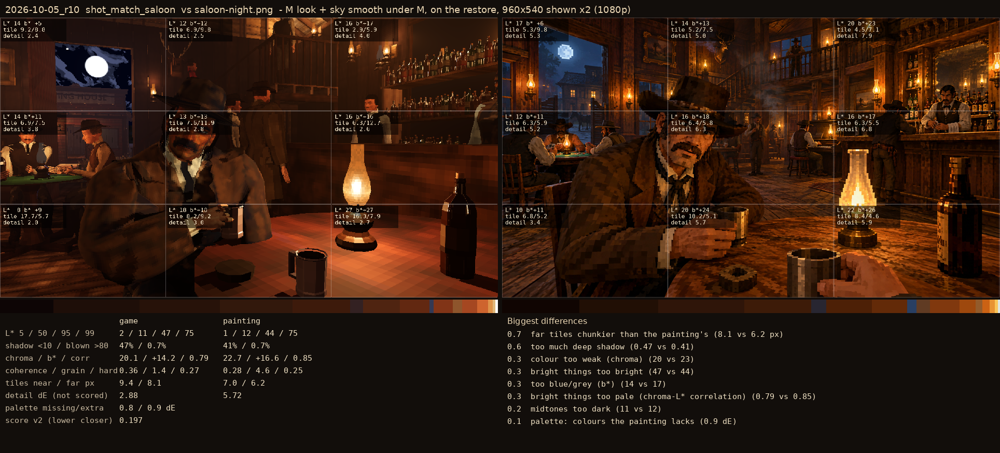
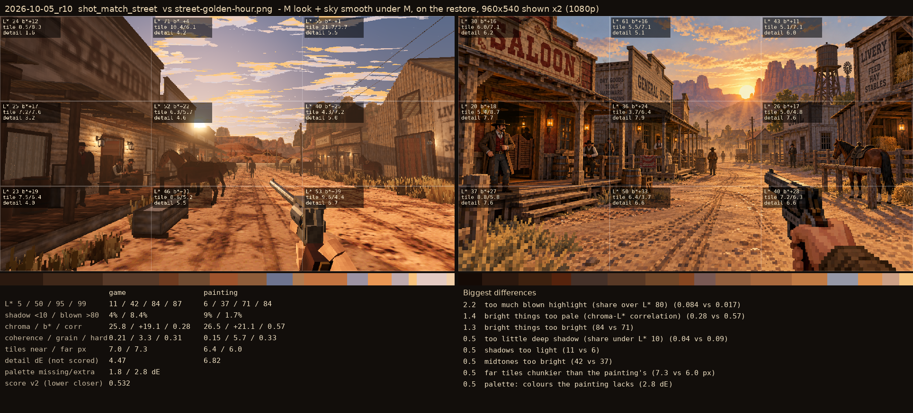

# 2026-10-05_r10: M look + sky smooth under M, on the restore, 960x540 shown x2 (1080p)

## shot_match_saloon (score 0.197, lower is closer)

- 0.7 far tiles chunkier than the painting's (8.1 vs 6.2 px)
- 0.6 too much deep shadow (0.47 vs 0.41)
- 0.3 colour too weak (chroma) (20 vs 23)
- 0.3 bright things too bright (47 vs 44)
- 0.3 too blue/grey (b*) (14 vs 17)
- 0.3 bright things too pale (chroma-L* correlation) (0.79 vs 0.85)
- 0.2 midtones too dark (11 vs 12)
- 0.1 palette: colours the painting lacks (0.9 dE)

## shot_match_street (score 0.532, lower is closer)

- 2.2 too much blown highlight (share over L* 80) (0.084 vs 0.017)
- 1.4 bright things too pale (chroma-L* correlation) (0.28 vs 0.57)
- 1.3 bright things too bright (84 vs 71)
- 0.5 too little deep shadow (share under L* 10) (0.04 vs 0.09)
- 0.5 shadows too light (11 vs 6)
- 0.5 midtones too bright (42 vs 37)
- 0.5 far tiles chunkier than the painting's (7.3 vs 6.0 px)
- 0.5 palette: colours the painting lacks (2.8 dE)
