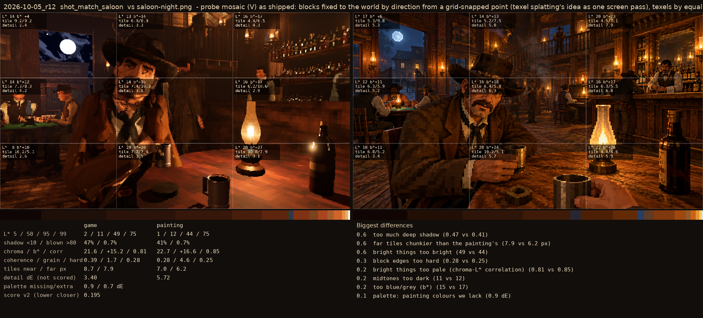
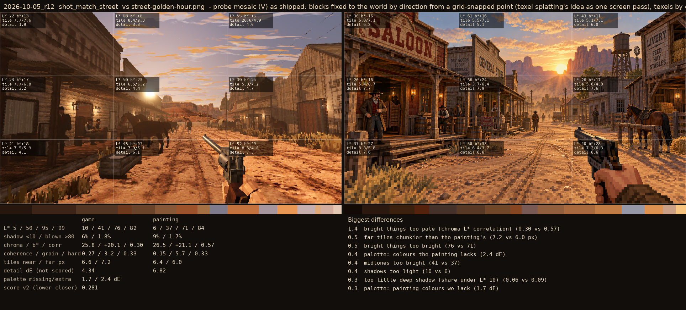

# 2026-10-05_r12: probe mosaic (V) as shipped: blocks fixed to the world by direction from a grid-snapped point (texel splatting's idea as one screen pass), texels by equal angle, one sample a block, smooth light, over the quantise-once textures

## shot_match_saloon (score 0.195, lower is closer)

- 0.6 too much deep shadow (0.47 vs 0.41)
- 0.6 far tiles chunkier than the painting's (7.9 vs 6.2 px)
- 0.6 bright things too bright (49 vs 44)
- 0.3 block edges too hard (0.28 vs 0.25)
- 0.2 bright things too pale (chroma-L* correlation) (0.81 vs 0.85)
- 0.2 midtones too dark (11 vs 12)
- 0.2 too blue/grey (b*) (15 vs 17)
- 0.1 palette: painting colours we lack (0.9 dE)

## shot_match_street (score 0.281, lower is closer)

- 1.4 bright things too pale (chroma-L* correlation) (0.30 vs 0.57)
- 0.5 far tiles chunkier than the painting's (7.2 vs 6.0 px)
- 0.5 bright things too bright (76 vs 71)
- 0.4 palette: colours the painting lacks (2.4 dE)
- 0.4 midtones too bright (41 vs 37)
- 0.4 shadows too light (10 vs 6)
- 0.3 too little deep shadow (share under L* 10) (0.06 vs 0.09)
- 0.3 palette: painting colours we lack (1.7 dE)
