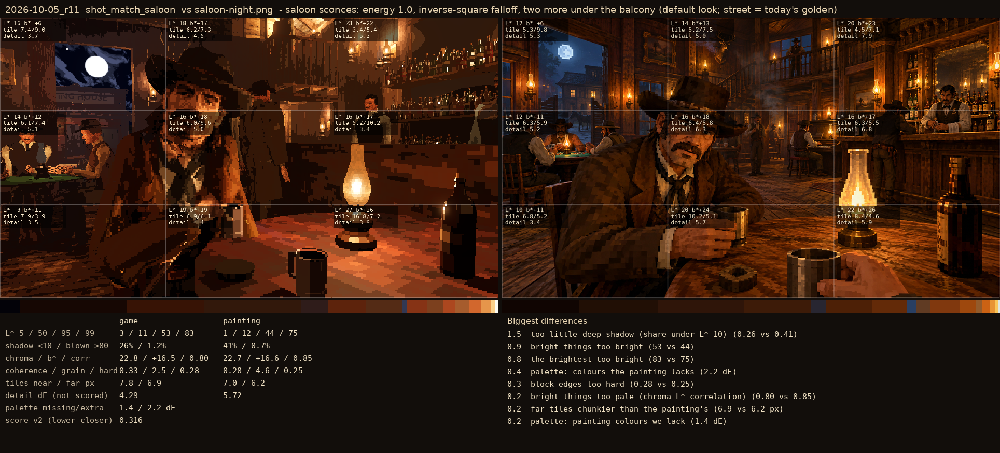
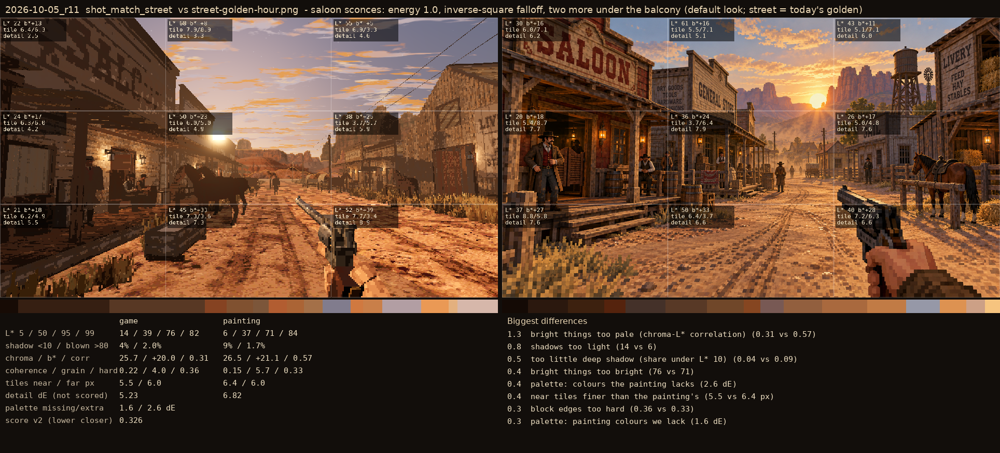

# 2026-10-05_r16: saloon sconces: energy 1.0, inverse-square falloff, two more under the balcony (default look; street = today's golden)

## shot_match_saloon (score 0.316, lower is closer)

- 1.5 too little deep shadow (share under L* 10) (0.26 vs 0.41)
- 0.9 bright things too bright (53 vs 44)
- 0.8 the brightest too bright (83 vs 75)
- 0.4 palette: colours the painting lacks (2.2 dE)
- 0.3 block edges too hard (0.28 vs 0.25)
- 0.2 bright things too pale (chroma-L* correlation) (0.80 vs 0.85)
- 0.2 far tiles chunkier than the painting's (6.9 vs 6.2 px)
- 0.2 palette: painting colours we lack (1.4 dE)

## shot_match_street (score 0.326, lower is closer)

- 1.3 bright things too pale (chroma-L* correlation) (0.31 vs 0.57)
- 0.8 shadows too light (14 vs 6)
- 0.5 too little deep shadow (share under L* 10) (0.04 vs 0.09)
- 0.4 bright things too bright (76 vs 71)
- 0.4 palette: colours the painting lacks (2.6 dE)
- 0.4 near tiles finer than the painting's (5.5 vs 6.4 px)
- 0.3 block edges too hard (0.36 vs 0.33)
- 0.3 palette: painting colours we lack (1.6 dE)
