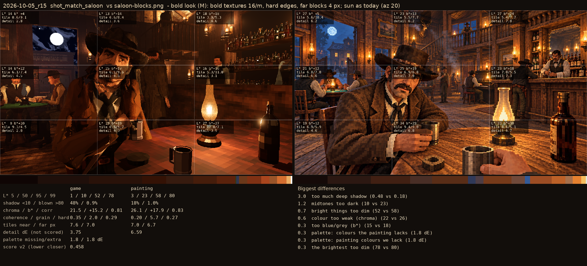
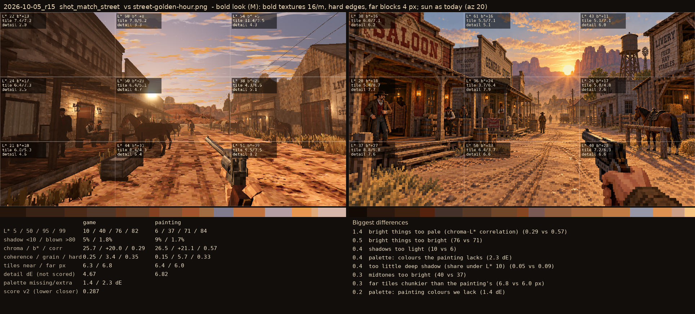

# 2026-10-05_r20: bold look (M): bold textures 16/m, hard edges, far blocks 4 px; sun as today (az 20)

## shot_match_saloon (score 0.458, lower is closer)

- 3.0 too much deep shadow (0.48 vs 0.18)
- 1.2 midtones too dark (10 vs 23)
- 0.7 bright things too dim (52 vs 58)
- 0.6 colour too weak (chroma) (22 vs 26)
- 0.3 too blue/grey (b*) (15 vs 18)
- 0.3 palette: colours the painting lacks (1.8 dE)
- 0.3 palette: painting colours we lack (1.8 dE)
- 0.3 the brightest too dim (78 vs 80)

## shot_match_street (score 0.287, lower is closer)

- 1.4 bright things too pale (chroma-L* correlation) (0.29 vs 0.57)
- 0.5 bright things too bright (76 vs 71)
- 0.4 shadows too light (10 vs 6)
- 0.4 palette: colours the painting lacks (2.3 dE)
- 0.4 too little deep shadow (share under L* 10) (0.05 vs 0.09)
- 0.3 midtones too bright (40 vs 37)
- 0.3 far tiles chunkier than the painting's (6.8 vs 6.0 px)
- 0.2 palette: painting colours we lack (1.4 dE)
