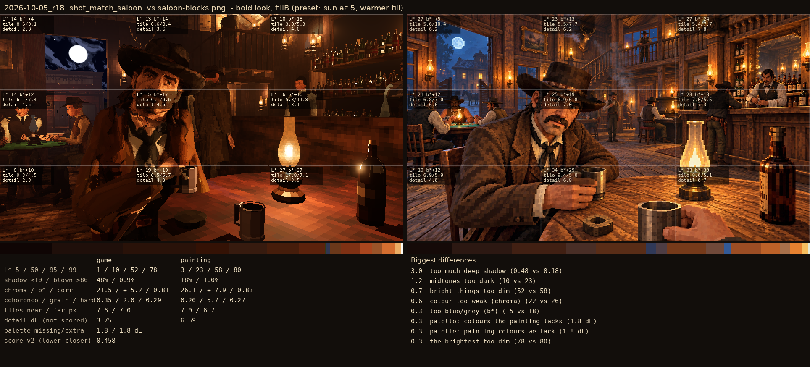
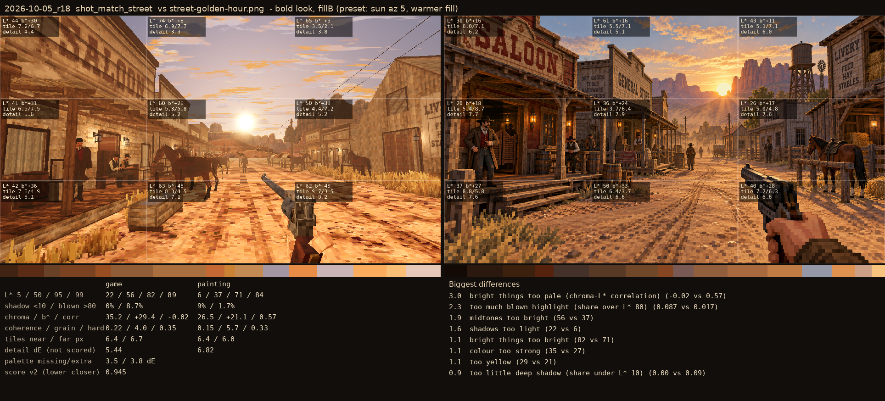

# 2026-10-05_r23: bold look, fillB (preset: sun az 5, warmer fill)

## shot_match_saloon (score 0.458, lower is closer)

- 3.0 too much deep shadow (0.48 vs 0.18)
- 1.2 midtones too dark (10 vs 23)
- 0.7 bright things too dim (52 vs 58)
- 0.6 colour too weak (chroma) (22 vs 26)
- 0.3 too blue/grey (b*) (15 vs 18)
- 0.3 palette: colours the painting lacks (1.8 dE)
- 0.3 palette: painting colours we lack (1.8 dE)
- 0.3 the brightest too dim (78 vs 80)

## shot_match_street (score 0.945, lower is closer)

- 3.0 bright things too pale (chroma-L* correlation) (-0.02 vs 0.57)
- 2.3 too much blown highlight (share over L* 80) (0.087 vs 0.017)
- 1.9 midtones too bright (56 vs 37)
- 1.6 shadows too light (22 vs 6)
- 1.1 bright things too bright (82 vs 71)
- 1.1 colour too strong (35 vs 27)
- 1.1 too yellow (29 vs 21)
- 0.9 too little deep shadow (share under L* 10) (0.00 vs 0.09)
