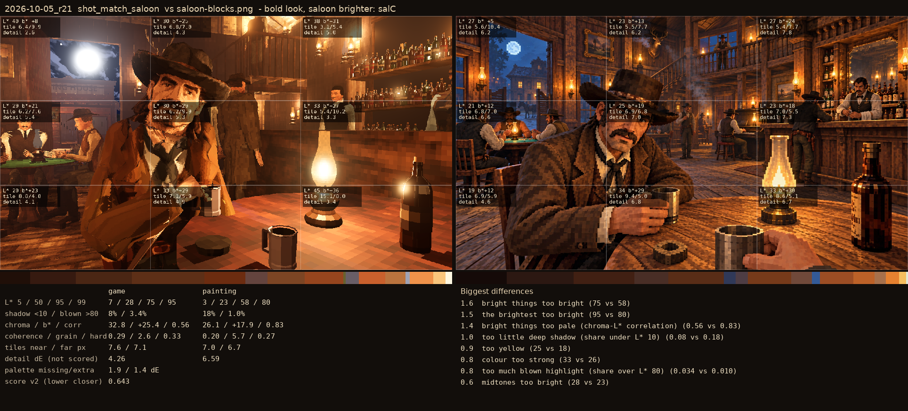
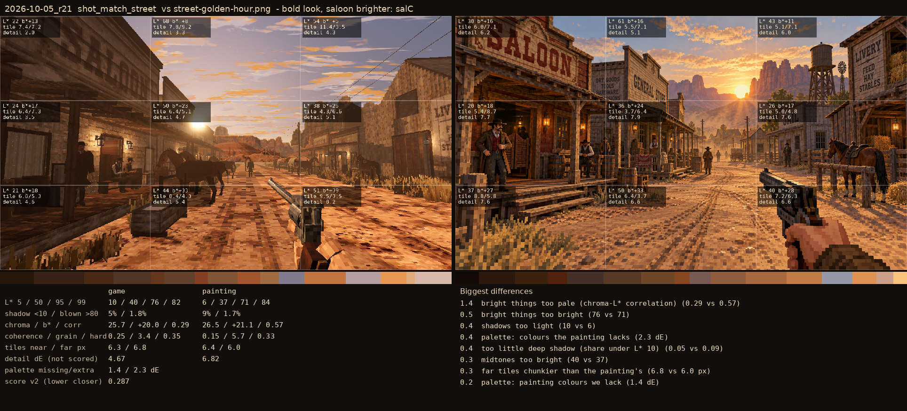

# 2026-10-05_r26: bold look, saloon brighter: salC

## shot_match_saloon (score 0.643, lower is closer)

- 1.6 bright things too bright (75 vs 58)
- 1.5 the brightest too bright (95 vs 80)
- 1.4 bright things too pale (chroma-L* correlation) (0.56 vs 0.83)
- 1.0 too little deep shadow (share under L* 10) (0.08 vs 0.18)
- 0.9 too yellow (25 vs 18)
- 0.8 colour too strong (33 vs 26)
- 0.8 too much blown highlight (share over L* 80) (0.034 vs 0.010)
- 0.6 midtones too bright (28 vs 23)

## shot_match_street (score 0.287, lower is closer)

- 1.4 bright things too pale (chroma-L* correlation) (0.29 vs 0.57)
- 0.5 bright things too bright (76 vs 71)
- 0.4 shadows too light (10 vs 6)
- 0.4 palette: colours the painting lacks (2.3 dE)
- 0.4 too little deep shadow (share under L* 10) (0.05 vs 0.09)
- 0.3 midtones too bright (40 vs 37)
- 0.3 far tiles chunkier than the painting's (6.8 vs 6.0 px)
- 0.2 palette: painting colours we lack (1.4 dE)
