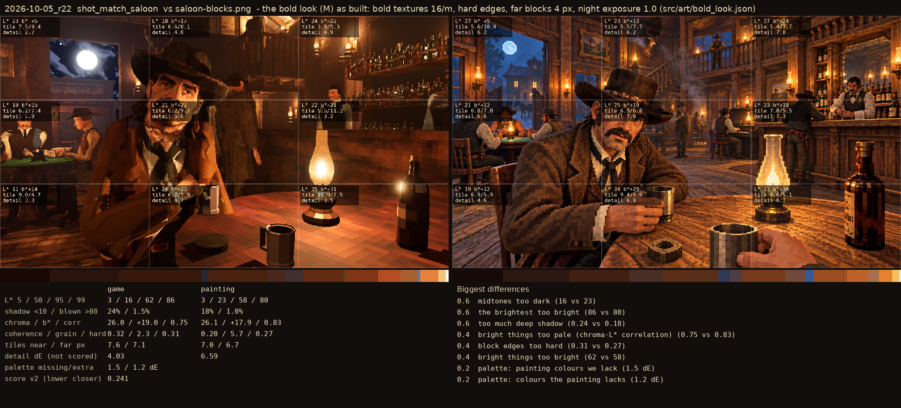
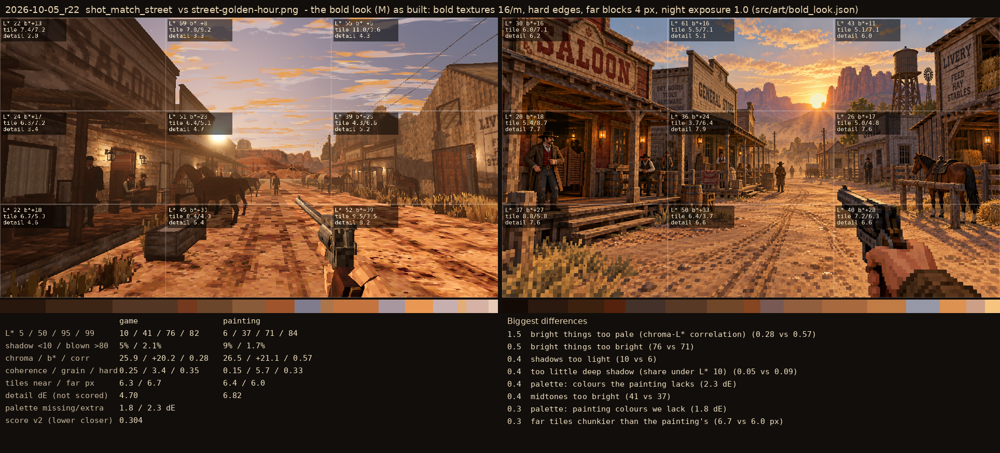

# 2026-10-05_r27: the bold look (M) as built: bold textures 16/m, hard edges, far blocks 4 px, night exposure 1.0 (src/art/bold_look.json)

## shot_match_saloon (score 0.241, lower is closer)

- 0.6 midtones too dark (16 vs 23)
- 0.6 the brightest too bright (86 vs 80)
- 0.6 too much deep shadow (0.24 vs 0.18)
- 0.4 bright things too pale (chroma-L* correlation) (0.75 vs 0.83)
- 0.4 block edges too hard (0.31 vs 0.27)
- 0.4 bright things too bright (62 vs 58)
- 0.2 palette: painting colours we lack (1.5 dE)
- 0.2 palette: colours the painting lacks (1.2 dE)

## shot_match_street (score 0.304, lower is closer)

- 1.5 bright things too pale (chroma-L* correlation) (0.28 vs 0.57)
- 0.5 bright things too bright (76 vs 71)
- 0.4 shadows too light (10 vs 6)
- 0.4 too little deep shadow (share under L* 10) (0.05 vs 0.09)
- 0.4 palette: colours the painting lacks (2.3 dE)
- 0.4 midtones too bright (41 vs 37)
- 0.3 palette: painting colours we lack (1.8 dE)
- 0.3 far tiles chunkier than the painting's (6.7 vs 6.0 px)
