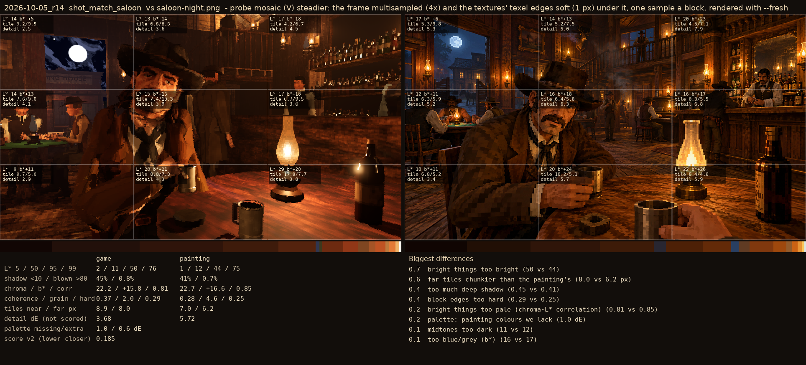
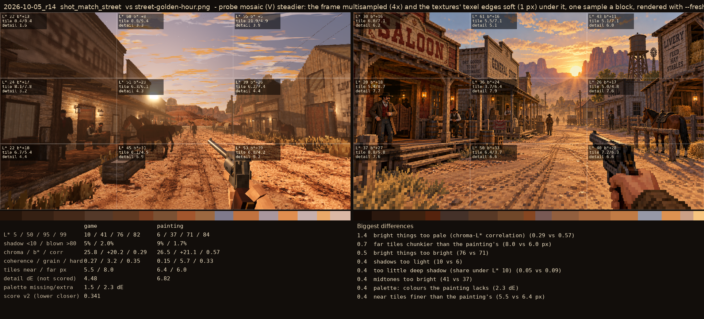

# 2026-10-05_r28: probe mosaic (V) steadier: the frame multisampled (4x) and the textures' texel edges soft (1 px) under it, one sample a block, rendered with --fresh

## shot_match_saloon (score 0.185, lower is closer)

- 0.7 bright things too bright (50 vs 44)
- 0.6 far tiles chunkier than the painting's (8.0 vs 6.2 px)
- 0.4 too much deep shadow (0.45 vs 0.41)
- 0.4 block edges too hard (0.29 vs 0.25)
- 0.2 bright things too pale (chroma-L* correlation) (0.81 vs 0.85)
- 0.2 palette: painting colours we lack (1.0 dE)
- 0.1 midtones too dark (11 vs 12)
- 0.1 too blue/grey (b*) (16 vs 17)

## shot_match_street (score 0.341, lower is closer)

- 1.4 bright things too pale (chroma-L* correlation) (0.29 vs 0.57)
- 0.7 far tiles chunkier than the painting's (8.0 vs 6.0 px)
- 0.5 bright things too bright (76 vs 71)
- 0.4 shadows too light (10 vs 6)
- 0.4 too little deep shadow (share under L* 10) (0.05 vs 0.09)
- 0.4 midtones too bright (41 vs 37)
- 0.4 palette: colours the painting lacks (2.3 dE)
- 0.4 near tiles finer than the painting's (5.5 vs 6.4 px)
