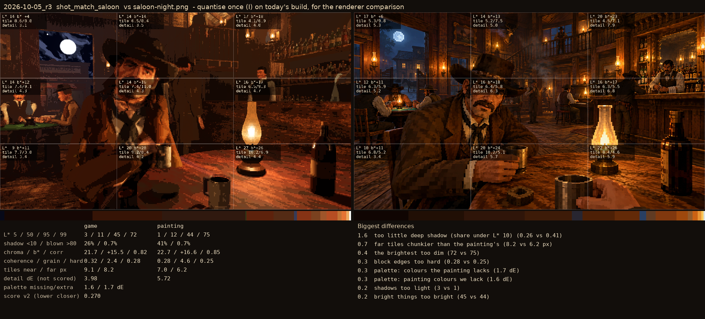
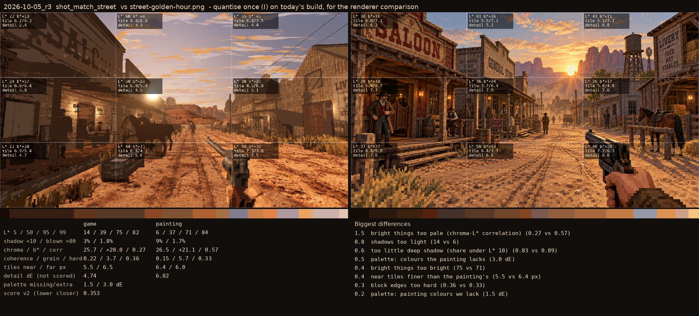

# 2026-10-05_r3: quantise once (I) on today's build, for the renderer comparison

## shot_match_saloon (score 0.270, lower is closer)

- 1.6 too little deep shadow (share under L* 10) (0.26 vs 0.41)
- 0.7 far tiles chunkier than the painting's (8.2 vs 6.2 px)
- 0.4 the brightest too dim (72 vs 75)
- 0.3 block edges too hard (0.28 vs 0.25)
- 0.3 palette: colours the painting lacks (1.7 dE)
- 0.3 palette: painting colours we lack (1.6 dE)
- 0.2 shadows too light (3 vs 1)
- 0.2 bright things too bright (45 vs 44)

## shot_match_street (score 0.353, lower is closer)

- 1.5 bright things too pale (chroma-L* correlation) (0.27 vs 0.57)
- 0.8 shadows too light (14 vs 6)
- 0.6 too little deep shadow (share under L* 10) (0.03 vs 0.09)
- 0.5 palette: colours the painting lacks (3.0 dE)
- 0.4 bright things too bright (75 vs 71)
- 0.4 near tiles finer than the painting's (5.5 vs 6.4 px)
- 0.3 block edges too hard (0.36 vs 0.33)
- 0.2 palette: painting colours we lack (1.5 dE)
