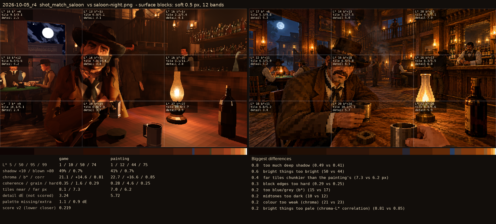
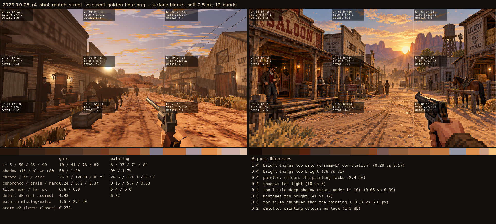

# 2026-10-05_r4: surface blocks: soft 0.5 px, 12 bands

## shot_match_saloon (score 0.219, lower is closer)

- 0.8 too much deep shadow (0.49 vs 0.41)
- 0.6 bright things too bright (50 vs 44)
- 0.4 far tiles chunkier than the painting's (7.3 vs 6.2 px)
- 0.3 block edges too hard (0.29 vs 0.25)
- 0.2 too blue/grey (b*) (15 vs 17)
- 0.2 midtones too dark (10 vs 12)
- 0.2 colour too weak (chroma) (21 vs 23)
- 0.2 bright things too pale (chroma-L* correlation) (0.81 vs 0.85)

## shot_match_street (score 0.278, lower is closer)

- 1.4 bright things too pale (chroma-L* correlation) (0.29 vs 0.57)
- 0.4 bright things too bright (76 vs 71)
- 0.4 palette: colours the painting lacks (2.4 dE)
- 0.4 shadows too light (10 vs 6)
- 0.4 too little deep shadow (share under L* 10) (0.05 vs 0.09)
- 0.3 midtones too bright (41 vs 37)
- 0.3 far tiles chunkier than the painting's (6.8 vs 6.0 px)
- 0.2 palette: painting colours we lack (1.5 dE)
