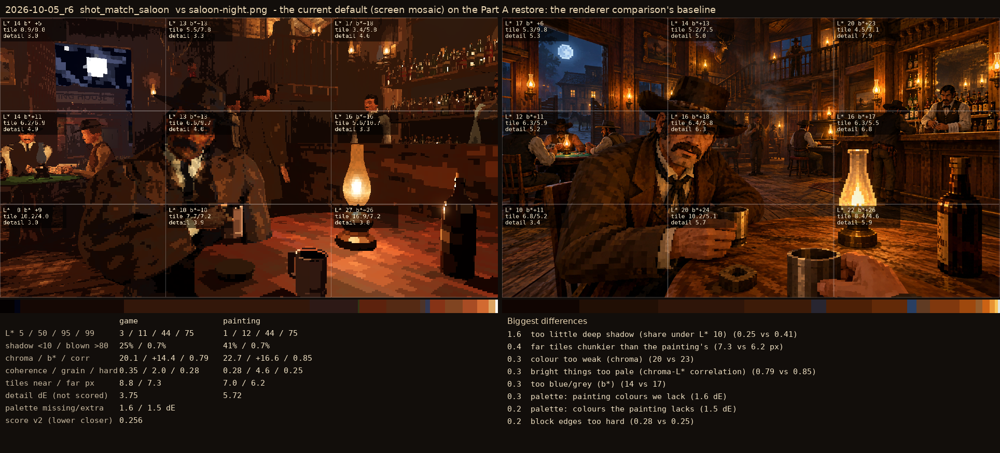
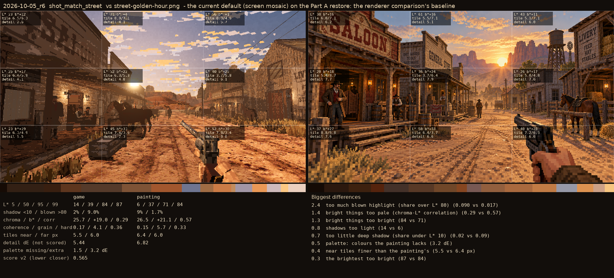

# 2026-10-05_r6: the current default (screen mosaic) on the Part A restore: the renderer comparison's baseline

## shot_match_saloon (score 0.256, lower is closer)

- 1.6 too little deep shadow (share under L* 10) (0.25 vs 0.41)
- 0.4 far tiles chunkier than the painting's (7.3 vs 6.2 px)
- 0.3 colour too weak (chroma) (20 vs 23)
- 0.3 bright things too pale (chroma-L* correlation) (0.79 vs 0.85)
- 0.3 too blue/grey (b*) (14 vs 17)
- 0.3 palette: painting colours we lack (1.6 dE)
- 0.2 palette: colours the painting lacks (1.5 dE)
- 0.2 block edges too hard (0.28 vs 0.25)

## shot_match_street (score 0.565, lower is closer)

- 2.4 too much blown highlight (share over L* 80) (0.090 vs 0.017)
- 1.4 bright things too pale (chroma-L* correlation) (0.29 vs 0.57)
- 1.3 bright things too bright (84 vs 71)
- 0.8 shadows too light (14 vs 6)
- 0.7 too little deep shadow (share under L* 10) (0.02 vs 0.09)
- 0.5 palette: colours the painting lacks (3.2 dE)
- 0.4 near tiles finer than the painting's (5.5 vs 6.4 px)
- 0.3 the brightest too bright (87 vs 84)
