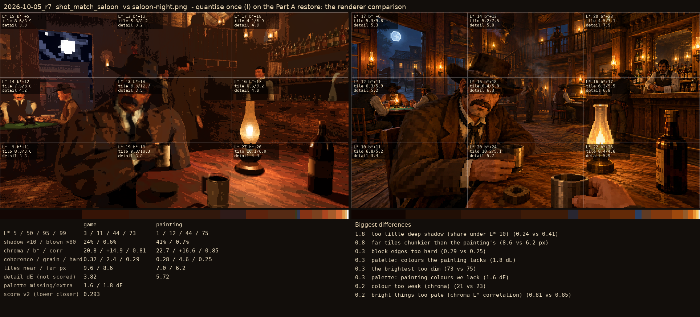
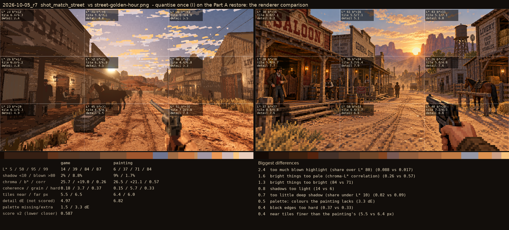

# 2026-10-05_r7: quantise once (I) on the Part A restore: the renderer comparison

## shot_match_saloon (score 0.293, lower is closer)

- 1.8 too little deep shadow (share under L* 10) (0.24 vs 0.41)
- 0.8 far tiles chunkier than the painting's (8.6 vs 6.2 px)
- 0.3 block edges too hard (0.29 vs 0.25)
- 0.3 palette: colours the painting lacks (1.8 dE)
- 0.3 the brightest too dim (73 vs 75)
- 0.3 palette: painting colours we lack (1.6 dE)
- 0.2 colour too weak (chroma) (21 vs 23)
- 0.2 bright things too pale (chroma-L* correlation) (0.81 vs 0.85)

## shot_match_street (score 0.587, lower is closer)

- 2.4 too much blown highlight (share over L* 80) (0.088 vs 0.017)
- 1.6 bright things too pale (chroma-L* correlation) (0.26 vs 0.57)
- 1.3 bright things too bright (84 vs 71)
- 0.8 shadows too light (14 vs 6)
- 0.7 too little deep shadow (share under L* 10) (0.02 vs 0.09)
- 0.5 palette: colours the painting lacks (3.3 dE)
- 0.4 block edges too hard (0.37 vs 0.33)
- 0.4 near tiles finer than the painting's (5.5 vs 6.4 px)
