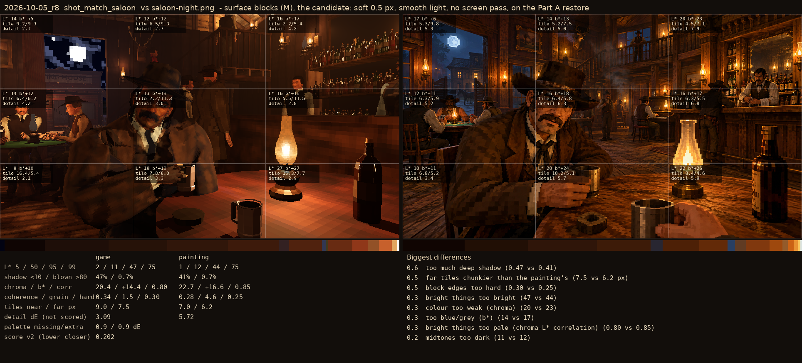
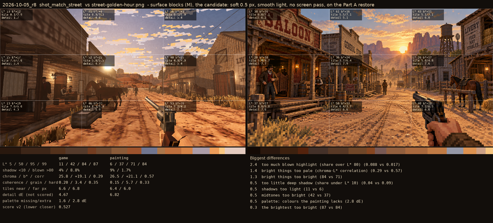

# 2026-10-05_r8: surface blocks (M), the candidate: soft 0.5 px, smooth light, no screen pass, on the Part A restore

## shot_match_saloon (score 0.202, lower is closer)

- 0.6 too much deep shadow (0.47 vs 0.41)
- 0.5 far tiles chunkier than the painting's (7.5 vs 6.2 px)
- 0.5 block edges too hard (0.30 vs 0.25)
- 0.3 bright things too bright (47 vs 44)
- 0.3 colour too weak (chroma) (20 vs 23)
- 0.3 too blue/grey (b*) (14 vs 17)
- 0.3 bright things too pale (chroma-L* correlation) (0.80 vs 0.85)
- 0.2 midtones too dark (11 vs 12)

## shot_match_street (score 0.527, lower is closer)

- 2.4 too much blown highlight (share over L* 80) (0.088 vs 0.017)
- 1.4 bright things too pale (chroma-L* correlation) (0.29 vs 0.57)
- 1.3 bright things too bright (84 vs 71)
- 0.5 too little deep shadow (share under L* 10) (0.04 vs 0.09)
- 0.5 shadows too light (11 vs 6)
- 0.5 midtones too bright (42 vs 37)
- 0.5 palette: colours the painting lacks (2.8 dE)
- 0.3 the brightest too bright (87 vs 84)
