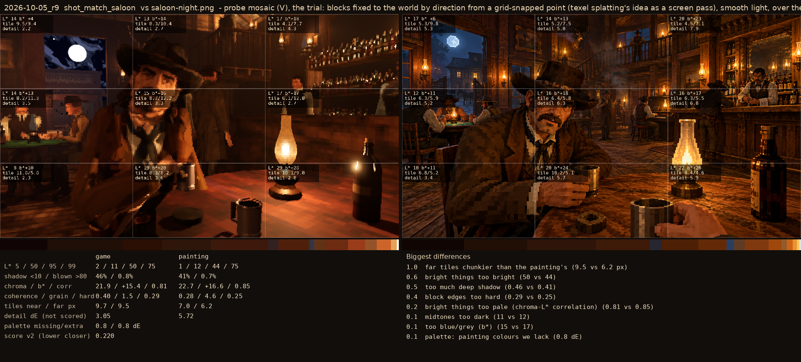
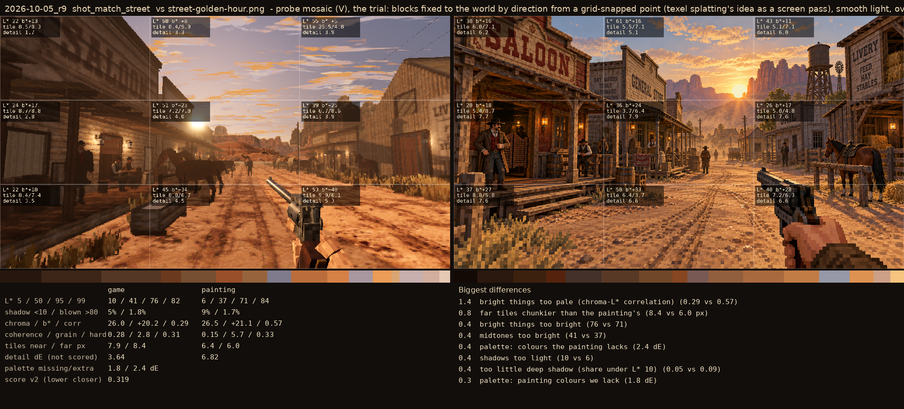

# 2026-10-05_r9: probe mosaic (V), the trial: blocks fixed to the world by direction from a grid-snapped point (texel splatting's idea as a screen pass), smooth light, over the quantise-once textures

## shot_match_saloon (score 0.220, lower is closer)

- 1.0 far tiles chunkier than the painting's (9.5 vs 6.2 px)
- 0.6 bright things too bright (50 vs 44)
- 0.5 too much deep shadow (0.46 vs 0.41)
- 0.4 block edges too hard (0.29 vs 0.25)
- 0.2 bright things too pale (chroma-L* correlation) (0.81 vs 0.85)
- 0.1 midtones too dark (11 vs 12)
- 0.1 too blue/grey (b*) (15 vs 17)
- 0.1 palette: painting colours we lack (0.8 dE)

## shot_match_street (score 0.319, lower is closer)

- 1.4 bright things too pale (chroma-L* correlation) (0.29 vs 0.57)
- 0.8 far tiles chunkier than the painting's (8.4 vs 6.0 px)
- 0.4 bright things too bright (76 vs 71)
- 0.4 midtones too bright (41 vs 37)
- 0.4 palette: colours the painting lacks (2.4 dE)
- 0.4 shadows too light (10 vs 6)
- 0.4 too little deep shadow (share under L* 10) (0.05 vs 0.09)
- 0.3 palette: painting colours we lack (1.8 dE)
